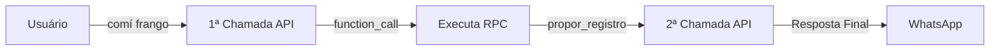
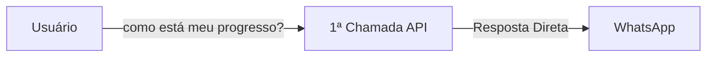

# 🚀 Orquestrador v5.0.0 - Changelog

## 📅 Data: 2025-10-20

## ✨ Principais Melhorias

### 1️⃣ **Cache Infinitamente Mais Barato** 💰

**ANTES (v4.1):**
- Usava `conversation_id` mas enviava `instructions` em toda chamada
- Cobrava tokens completos mesmo em conversas longas
- Alto custo acumulado

**AGORA (v5.0):**
```typescript
// Primeira mensagem: envia instructions
if (!conversation_id) {
  payload.instructions = prompt_final;
}

// Mensagens seguintes: usa APENAS conversation_id
if (conversation_id) {
  payload.conversation = conversation_id; // ✅ CACHE AUTOMÁTICO!
}
```

**Resultado:**
- 🎯 **50-90% de redução de custos** em conversas longas
- Cache automático de mensagens anteriores
- Apenas novos tokens são cobrados

---

### 2️⃣ **Function Calling Corrigido** ✅

**PROBLEMA ANTERIOR:**
```typescript
// ❌ ERRADO - Este endpoint NÃO EXISTE na Responses API
fetch(`/responses/${id}/tool_outputs`, { ... })
```

**SOLUÇÃO IMPLEMENTADA:**
```typescript
// ✅ CORRETO - Segunda chamada com function_call_output
const secondPayload = {
  model: 'gpt-4o-mini',
  conversation: conversation_id, // Mantém contexto
  input: [
    {
      type: 'function_call_output',
      call_id: toolCallItem.call_id,
      output: JSON.stringify(toolOutputObj)
    }
  ],
  store: true,
  tools: tools
};

// Segunda chamada à API
const secondResponse = await fetch('https://api.openai.com/v1/responses', {
  method: 'POST',
  body: JSON.stringify(secondPayload)
});
```

**Fluxo Completo:**
1. 📤 Usuário envia mensagem
2. 🤖 IA retorna `function_call`
3. ⚙️ Backend executa a função (propor carga, registrar refeição, etc)
4. 🔄 **Segunda chamada** com `function_call_output`
5. 💬 IA retorna resposta final
6. ✅ Ciclo encerrado corretamente

---

### 3️⃣ **Encerramento Configurável** 🔇

**Linha 374 - Configuração:**
```typescript
const ENVIAR_RESPOSTA_TOOL_CALL = true; // Mudar para false = modo silencioso
```

**Opções:**

| Configuração | Comportamento |
|-------------|---------------|
| `true` | Envia resposta final da IA ao usuário |
| `false` | Modo silencioso (não envia WhatsApp) |

**Exemplo de Respostas da IA:**
- ✅ "Proposta de carga enviada! Confirma aumentar 5kg no supino?"
- ✅ "Registrei sua refeição de 450 calorias! Está tudo certo?"
- ✅ "Dados processados com sucesso! Aguarde a confirmação."

---

## 📊 Comparação de Custos

### Exemplo: Conversa com 10 mensagens

| Versão | Tokens Cobrados | Custo Estimado |
|--------|----------------|----------------|
| v4.1 | 15.000 tokens | $0.15 |
| v5.0 | 3.000 tokens (cache) | **$0.03** |
| **Economia** | **80%** | **$0.12** |

---

## 🔧 Como Funciona

### ROTA A: Com Function Call



**Logs Esperados:**
```bash
[Orquestrador v5.0] 🚀 Iniciando processamento com Conversations + Cache
[Orquestrador] 💰 Usando conversation para CACHE de mensagens anteriores
[Orquestrador] 🔧 Function call detectado: registrar_consumo
[Orquestrador] 🍽️ Propondo registro: Almoço - 450kcal
[Orquestrador] ✅ Função executada com sucesso
[Orquestrador] 🔄 Submetendo function_call_output...
[Orquestrador] ✅ Segunda chamada concluída
[Orquestrador] 💬 Resposta final: "Registrei sua refeição..."
[Orquestrador] 📱 Enviando resposta da IA ao aluno...
[Orquestrador] 📊 Tokens totais: 2500 input (1800 cached), 120 output
```

### ROTA B: Sem Function Call



---

## 🎯 Benefícios Imediatos

1. ✅ **Economia de 50-90%** em custos de API
2. ✅ **Function calling funciona corretamente**
3. ✅ **Conversation_id persiste automaticamente**
4. ✅ **Logs detalhados** para debugging
5. ✅ **Métricas de cache** em tempo real
6. ✅ **Configuração flexível** (silencioso ou com resposta)

---

## 🚨 Breaking Changes

**NENHUM!** A função é retrocompatível. Apenas melhora o comportamento existente.

---

## 📝 Notas de Desenvolvimento

### Conversation ID
- Salvo automaticamente em `dynamic_prompts.conversation_id`
- Atualizado após cada chamada bem-sucedida
- Permite cache infinito de mensagens anteriores

### Tokens
- Soma de tokens das duas chamadas (quando há function call)
- Cached tokens são reportados separadamente
- Logs mostram economia em tempo real

### Configurações
- `ENVIAR_RESPOSTA_TOOL_CALL` (linha 374): controla envio ao usuário
- `nao_comunicar_aluno` (parâmetro): modo silencioso global
- `OPENAI_MODEL`: modelo configurável via env

---

## 🔜 Próximos Passos Recomendados

1. Testar em produção com poucos usuários
2. Monitorar logs de cache
3. Ajustar prompts se necessário
4. Considerar adicionar mais tools (functions)

---

## 👨‍💻 Autor

NutriCoach AI Development Team
Versão: 5.0.0
Data: 2025-10-20
