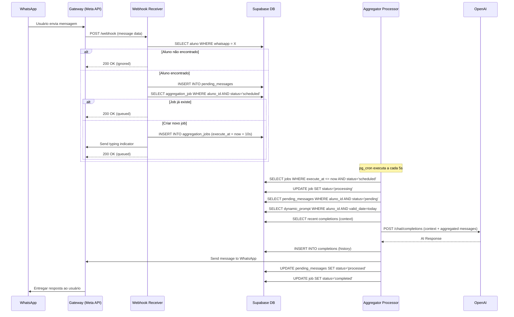
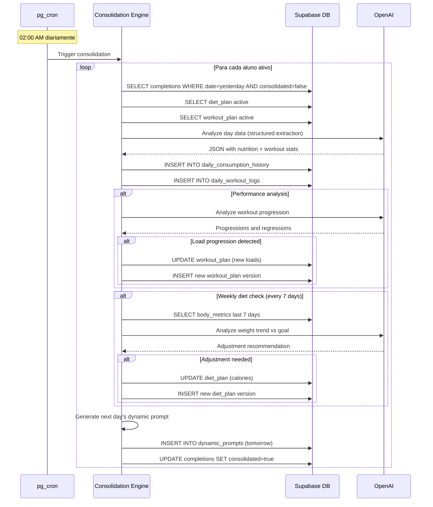
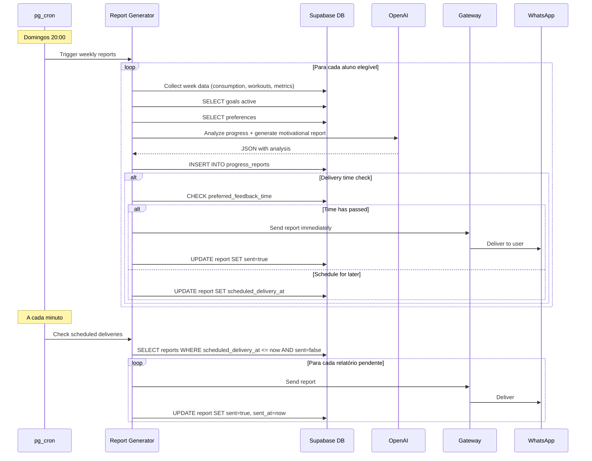

**Critérios de Entrada:**
- Onboarding completo funcional
- Geração de planos (dieta + treino)
- Interação via WhatsApp (agregador + IA)
- Consolidação noturna básica

**Métricas de Sucesso:**
- 80% dos beta testers completam onboarding
- Média de 5+ interações/dia por usuário
- NPS ≥ 50
- 70% dos usuários registram consumo alimentar diariamente
- 0 bugs críticos por 7 dias consecutivos

**Perfil dos Beta Testers:**
- Amigos, familiares e early adopters tech-savvy
- Dispostos a dar feedback detalhado
- Comprometidos com objetivos reais de fitness

### Fase 1: Soft Launch (Mês 3-4)
**Objetivo:** Escalar para 100-200 usuários pagantes e validar modelo de negócio

**Funcionalidades Adicionais:**
- Sistema de pagamento (Stripe)
- Relatórios semanais automatizados
- Lembretes inteligentes de hidratação e medições
- Versionamento completo de planos

**Estratégia de Aquisição:**
- Anúncios no Instagram/Facebook (público frio)
- Parcerias com microinfluenciadores de fitness (5k-50k seguidores)
- Trial gratuito de 7 dias
- Orçamento: R$ 10.000 em ads (CAC alvo: R$ 50)

**Métricas de Sucesso:**
- Conversão trial → pago: ≥ 30%
- Churn mensal: ≤ 10%
- CAC/LTV ratio: ≤ 1:3
- Tempo médio de resposta da IA: < 3 segundos

### Fase 2: Public Launch (Mês 5-6)
**Objetivo:** Atingir 500-1.000 usuários ativos e Product-Market Fit

**Funcionalidades Adicionais:**
- Painel web para visualização de progresso
- Exportação de relatórios em PDF
- Integração com wearables (Garmin, Apple Watch via HealthKit)
- Sistema de gamificação básico (badges, streaks)

**Estratégia de Aquisição:**
- Campanha de lançamento com desconto (50% primeiro mês)
- Programa de indicação (R$ 30 de desconto para ambos)
- Conteúdo orgânico SEO (blog posts, vídeos explicativos)
- Parcerias com academias (trial gratuito para membros)
- Orçamento: R$ 50.000 em ads (CAC alvo: R$ 80)

**Métricas de Sucesso:**
- MRR: R$ 45.000 - R$ 90.000
- Churn mensal: ≤ 8%
- NPS ≥ 60
- Viralidade (K-factor): ≥ 0.3

### Fase 3: Escala e B2B2C (Mês 7-12)
**Objetivo:** 3.000+ usuários B2C e primeiros 10 profissionais B2B

**Funcionalidades B2B:**
- Dashboard profissional para nutricionistas/PTs
- White-label (logo e cores customizáveis)
- Gestão de múltiplos clientes
- Aprovação de planos antes da IA executar
- Relatórios gerenciais

**Estratégia:**
- Lançar tier "Pro" para profissionais (R$ 297/mês + R$ 29/cliente gerenciado)
- Webinars para nutricionistas e personal trainers
- Presença em eventos de fitness e nutrição
- Certificação de profissionais parceiros

## 4.2 Estratégia de Pricing

### B2C (Usuário Final)

**Tier 1: Basic (Lançamento)**
- R$ 89,90/mês
- R$ 239,70/trimestre (11% off = R$ 79,90/mês)
- R$ 799,90/ano (26% off = R$ 66,66/mês)

**Inclui:**
- Planos personalizados de dieta e treino
- Coaching 24/7 via WhatsApp
- Ajustes automáticos semanais
- Relatórios de progresso semanais
- Suporte via chat

**Tier 2: Premium (Futuro - Mês 9)**
- R$ 149,90/mês
- R$ 399,90/trimestre (R$ 133,30/mês)
- R$ 1.399,90/ano (R$ 116,66/mês)

**Inclui tudo do Basic +**
- Consultas mensais com nutricionista/PT humano (videochamada)
- Análise de exames laboratoriais
- Planos de suplementação personalizados
- Integração com wearables
- Prioridade no suporte

### B2B (Profissionais)

**Tier Profissional:**
- R$ 297/mês (plataforma base)
- + R$ 29/mês por cliente gerenciado
- Sem limite de clientes

**Exemplo de Rentabilidade para o Profissional:**
- Profissional cobra R$ 400/mês por cliente
- Custo NutriCoach: R$ 297 + (20 × R$ 29) = R$ 877
- Receita: 20 × R$ 400 = R$ 8.000
- Lucro líquido: R$ 7.123 (~89% de margem)
- **Vs modelo tradicional:** atender 20 clientes humanamente é inviável

## 4.3 Projeções Financeiras (36 meses)

### Premissas Base

**Custos Variáveis por Usuário/Mês:**
- OpenAI API: R$ 8,00
- WhatsApp API: R$ 4,00
- Supabase: R$ 2,50
- CDN/Storage: R$ 0,50
- **Total CVU:** R$ 15,00

**Custos Fixos Mensais:**
- Infraestrutura base (Supabase Pro): R$ 250
- Ferramentas SaaS (Stripe, analytics): R$ 500
- Marketing: variável por fase
- Equipe: variável por fase
- **Total inicial:** ~R$ 750

### Cenário Base (Realista)

| Mês | Novos Usuários | Total Ativos | Churn | MRR | Custos | Lucro Mensal |
|-----|----------------|--------------|-------|-----|--------|--------------|
| 1-2 | 25 | 25 | 0% | R$ 0 | R$ 750 | -R$ 750 |
| 3 | 50 | 70 | 8% | R$ 5.600 | R$ 11.800 | -R$ 6.200 |
| 6 | 150 | 500 | 8% | R$ 40.000 | R$ 58.250 | -R$ 18.250 |
| 12 | 300 | 2.000 | 7% | R$ 160.000 | R$ 110.750 | R$ 49.250 |
| 24 | 500 | 8.000 | 6% | R$ 640.000 | R$ 260.750 | R$ 379.250 |
| 36 | 800 | 20.000 | 5% | R$ 1.600.000 | R$ 560.750 | R$ 1.039.250 |

### Análise de Viabilidade

**Break-even:** Mês 11 (~1.800 usuários ativos)

**Payback de Aquisição:**
- CAC médio: R$ 80
- LTV (18 meses de retenção): R$ 1.440
- LTV/CAC: 18x
- Payback: 1,1 meses

**Unit Economics Saudáveis:**
- Margem de contribuição: 83% (R$ 74,90 de margem por R$ 89,90 de receita)
- Cash flow positivo em operação após mês 11

---

# Capítulo 5: Roadmap de Desenvolvimento

## 5.1 Milestone 1: MVP Core (Semanas 1-8)

### Semanas 1-2: Fundação
**Backend:**
- [ ] Setup Supabase project
- [ ] Criar schema inicial do banco (alunos, goals, preferences, body_metrics)
- [ ] Setup Edge Functions base
- [ ] Implementar webhook receiver
- [ ] Configurar integração WhatsApp API (sandbox)

**Frontend:**
- [ ] Criar landing page de captura
- [ ] Criar formulário de onboarding web

**Testes:**
- [ ] Webhook recebe mensagens corretamente
- [ ] Dados de onboarding salvos no banco

### Semanas 3-4: Geração de Planos
**Backend:**
- [ ] Implementar lógica de cálculo de TDEE e macros
- [ ] Criar prompts para geração de diet_plans
- [ ] Criar prompts para geração de workout_plans
- [ ] Implementar Edge Function: plan_generator
- [ ] Criar tabelas diet_plans e workout_plans

**IA:**
- [ ] Testar e otimizar prompts de geração
- [ ] Validar qualidade dos planos gerados (10 perfis diferentes)
- [ ] Implementar validações de segurança (ex: não prescrever déficit > 500kcal/dia)

**Testes:**
- [ ] Planos gerados são personalizados e realistas
- [ ] Planos respeitam restrições e preferências
- [ ] Tempo de geração < 30 segundos

### Semanas 5-6: Agregador e Conversação
**Backend:**
- [ ] Criar tabelas pending_messages e aggregation_jobs
- [ ] Implementar Edge Function: message_aggregator_processor
- [ ] Configurar pg_cron para executar aggregator a cada 5s
- [ ] Implementar lógica de agregação (janela de 10s)
- [ ] Criar tabela dynamic_prompts
- [ ] Implementar geração de prompt dinâmico do dia

**IA:**
- [ ] Implementar processamento de linguagem natural para:
  - Registro de alimentos
  - Registro de água
  - Registro de treino
  - Perguntas sobre plano
- [ ] Criar prompts de sistema personalizados
- [ ] Implementar cálculo nutricional via base TACO

**Testes:**
- [ ] Mensagens fragmentadas são agregadas corretamente
- [ ] IA responde contextualizadamente
- [ ] Registros são extraídos com precisão > 90%

### Semanas 7-8: Consolidação Noturna
**Backend:**
- [ ] Criar tabelas completions, daily_consumption_history, daily_workout_logs
- [ ] Implementar Edge Function: consolidation_engine
- [ ] Configurar pg_cron para consolidação às 02:00
- [ ] Implementar lógica de análise e estruturação de dados
- [ ] Implementar atualização de cargas (workout_plans)
- [ ] Implementar geração de prompt dinâmico do próximo dia

**IA:**
- [ ] Criar prompt de análise diária
- [ ] Validar JSON outputs estruturados
- [ ] Implementar lógica de progressão de cargas

**Testes:**
- [ ] Dados são consolidados corretamente
- [ ] Cargas são atualizadas quando apropriado
- [ ] Prompt dinâmico é gerado com contexto completo

### Entrega MVP:
- [ ] 5 beta testers testando por 7 dias consecutivos
- [ ] Feedback coletado e bugs críticos corrigidos
- [ ] Documentação técnica básica

## 5.2 Milestone 2: Soft Launch (Semanas 9-16)

### Semanas 9-10: Sistema de Medições e Progresso
**Backend:**
- [ ] Implementar detecção automática de medições nas mensagens
- [ ] Criar lógica de cálculo de progresso
- [ ] Implementar lembretes de medição baseados em preferências
- [ ] Criar Edge Function: measurement_reminder

**Frontend:**
- [ ] Dashboard web básico (visualização de gráficos de progresso)

**Testes:**
- [ ] Medições são processadas corretamente
- [ ] Lembretes são enviados no dia/horário corretos
- [ ] Cálculos de progresso estão precisos

### Semanas 11-12: Relatórios Semanais
**Backend:**
- [ ] Criar tabela progress_reports
- [ ] Implementar Edge Function: report_generator
- [ ] Configurar pg_cron para geração semanal
- [ ] Implementar coleta de dados da semana
- [ ] Implementar agendamento de entrega por horário preferido

**IA:**
- [ ] Criar prompt de análise semanal
- [ ] Validar qualidade dos relatórios (tom motivacional, precisão)

**Testes:**
- [ ] Relatórios gerados refletem dados reais
- [ ] Entrega ocorre no horário preferido
- [ ] Formato é legível e motivacional

### Semanas 13-14: Pagamentos e Billing
**Backend:**
- [ ] Integrar Stripe (checkout, webhooks)
- [ ] Implementar lógica de trial (7 dias)
- [ ] Implementar bloqueio de acesso após trial sem pagamento
- [ ] Criar Edge Function: subscription_manager
- [ ] Implementar renovação automática

**Frontend:**
- [ ] Página de checkout
- [ ] Página de gerenciamento de assinatura

**Testes:**
- [ ] Fluxo completo de trial → pagamento
- [ ] Webhooks do Stripe processados corretamente
- [ ] Acesso é bloqueado/liberado conforme status

### Semanas 15-16: Otimização e Preparação
**Backend:**
- [ ] Implementar caching de prompts dinâmicos
- [ ] Otimizar queries de banco (índices, explain analyze)
- [ ] Implementar rate limiting
- [ ] Implementar sistema de logs estruturados
- [ ] Setup monitoring (Sentry para erros)

**DevOps:**
- [ ] CI/CD pipeline (GitHub Actions)
- [ ] Ambiente de staging
- [ ] Backups automáticos do banco

**Marketing:**
- [ ] Landing page otimizada para conversão
- [ ] Vídeo explicativo (60s)
- [ ] Setup Facebook Pixel e Google Analytics
- [ ] Criar 5 anúncios para teste A/B

### Entrega Soft Launch:
- [ ] Sistema de pagamento funcional
- [ ] 50 usuários pagantes ativos
- [ ] Churn < 10% no primeiro mês
- [ ] Infraestrutura estável (uptime > 99%)

## 5.3 Milestone 3: Public Launch (Semanas 17-24)

### Semanas 17-18: Painel Web
**Frontend:**
- [ ] Dashboard completo (gráficos de peso, aderência, volume de treino)
- [ ] Visualização de planos atuais (dieta e treino)
- [ ] Histórico de medições com fotos
- [ ] Exportação de relatórios em PDF
- [ ] Área de configurações (preferências, dados de conta)

**Backend:**
- [ ] APIs REST para frontend (com autenticação)

### Semanas 19-20: Melhorias de Experiência
**Features:**
- [ ] Typing indicators no WhatsApp
- [ ] Suporte a áudio (transcrição via Whisper API)
- [ ] Suporte a fotos de refeições (análise visual básica)
- [ ] Sistema de favoritos (receitas, treinos)
- [ ] Histórico de conversas (busca)

**IA:**
- [ ] Melhorias nos prompts baseadas em feedback
- [ ] Implementar fallbacks para casos edge
- [ ] Suporte a substituições contextuais

### Semanas 21-22: Gamificação e Engajamento
**Features:**
- [ ] Sistema de badges (conquistas)
- [ ] Streaks (dias consecutivos de aderência)
- [ ] Desafios semanais
- [ ] Ranking de progresso (opcional, privado)

**Backend:**
- [ ] Tabela achievements
- [ ] Lógica de desbloqueio de badges
- [ ] Notificações de conquistas

### Semanas 23-24: Integrações
**Features:**
- [ ] Integração HealthKit (Apple Watch)
- [ ] Integração Google Fit
- [ ] Importação de dados de wearables

**Marketing:**
- [ ] Campanha de lançamento
- [ ] Press kit para imprensa tech
- [ ] Programa de indicação implementado
- [ ] Parcerias com academias (5 iniciais)

### Entrega Public Launch:
- [ ] 500+ usuários ativos
- [ ] NPS ≥ 60
- [ ] CAC/LTV saudável (1:3+)
- [ ] Mídia orgânica (ao menos 3 publicações)

## 5.4 Milestone 4: B2B2C e Escala (Mês 7-12)

### Funcionalidades B2B
- [ ] Dashboard profissional multi-cliente
- [ ] Sistema de aprovação de planos
- [ ] White-label básico
- [ ] Relatórios gerenciais
- [ ] API para integrações

### Operações
- [ ] Suporte via chat para profissionais
- [ ] Materiais de onboarding para profissionais
- [ ] Certificação de parceiros
- [ ] SLA de uptime (99.9%)

---

# Capítulo 6: Gestão de Riscos e Mitigação

## 6.1 Riscos Técnicos

### Risco 1: Instabilidade da API do WhatsApp
**Probabilidade:** Média | **Impacto:** Crítico

**Mitigação:**
- Implementar retry logic com exponential backoff
- Monitoramento 24/7 com alertas (PagerDuty)
- Fallback: enviar SMS se WhatsApp falhar por > 5 minutos
- Manter comunicação com Meta sobre mudanças na API

### Risco 2: Custos de IA Descontrolados
**Probabilidade:** Média | **Impacto:** Alto

**Mitigação:**
- Implementar rate limiting por usuário (máximo 50 mensagens/dia)
- Caching agressivo de prompts dinâmicos
- Usar GPT-3.5-turbo para interações simples
- Monitorar custos diariamente com alertas (> R$ 100/dia)
- Estabelecer budget cap no OpenAI

### Risco 3: Latência Alta nas Respostas
**Probabilidade:** Baixa | **Impacto:** Médio

**Mitigação:**
- Otimizar tamanho dos prompts (< 2000 tokens)
- Usar streaming de respostas (chunks)
- CDN para assets estáticos
- Edge Functions geograficamente distribuídas (Supabase)
- Monitorar P95 latency (alerta se > 5s)

### Risco 4: Perda de Dados
**Probabilidade:** Baixa | **Impacto:** Crítico

**Mitigação:**
- Backups automáticos diários (Supabase)
- Retenção de 30 dias de snapshots
- Teste de restore mensal
- Replicação em múltiplas zonas de disponibilidade
- Auditoria completa de mudanças críticas

## 6.2 Riscos de Negócio

### Risco 5: Baixa Conversão Trial → Pago
**Probabilidade:** Média | **Impacto:** Alto

**Mitigação:**
- Onboarding guiado com checklist de valor
- Email drip campaign durante trial (dias 1, 3, 5, 7)
- Notificação 24h antes do fim do trial
- Oferecer desconto de 20% se converter no último dia
- Analisar cohorts semanalmente para otimizar

### Risco 6: Churn Alto (> 10%/mês)
**Probabilidade:** Média | **Impacto:** Crítico

**Mitigação:**
- Pesquisa de cancelamento (obrigatória)
- Win-back campaigns (oferecer pausa de assinatura)
- Análise de cohorts para identificar padrões de churn
- Melhorias de produto baseadas em feedback
- Notificações de progresso para reengajar usuários inativos

### Risco 7: Saturação do Mercado
**Probabilidade:** Baixa | **Impacto:** Médio

**Mitigação:**
- Diferenciação clara (WhatsApp + adaptação inteligente)
- Pivot rápido para B2B2C se necessário
- Expansão geográfica (América Latina)
- Parcerias estratégicas com marcas de suplementos
- Construção de moat via dados proprietários

## 6.3 Riscos Regulatórios

### Risco 8: LGPD / Privacidade de Dados
**Probabilidade:** Baixa | **Impacto:** Alto

**Mitigação:**
- Compliance LGPD desde o design
- Termos de uso e política de privacidade claros
- Consentimento explícito para coleta de dados
- Direito ao esquecimento implementado (soft delete)
- Auditoria anual de segurança
- Não vender dados de terceiros jamais

### Risco 9: Prescrição Nutricional sem CRN
**Probabilidade:** Baixa | **Impacto:** Crítico

**Mitigação:**
- Disclaimers claros: "sugestões educacionais, não prescrição"
- No tier B2C: apenas orientação geral, não personalização clínica
- No tier B2B: profissional assume responsabilidade legal
- Parcerias com nutricionistas registrados para revisão
- Seguro de responsabilidade civil

## 6.4 Riscos de Operação

### Risco 10: Suporte ao Cliente Sobrecarregado
**Probabilidade:** Alta | **Impacto:** Médio

**Mitigação:**
- Base de conhecimento (FAQ) automatizada
- Chatbot de suporte para perguntas comuns
- Monitorar tickets de suporte e contratar conforme necessário
- Meta: < 24h de tempo de resposta
- Priorizar bugs que afetam múltiplos usuários

---

# Capítulo 7: Métricas de Sucesso e KPIs

## 7.1 Métricas de Produto

### Engajamento
- **DAU/MAU ratio:** > 0.6 (usuários ativos diários/mensais)
- **Mensagens por usuário/dia:** 5-15 (sweet spot)
- **Taxa de conclusão de onboarding:** > 80%
- **Dias até primeira interação:** < 2 horas

### Retenção
- **D1 retention:** > 80%
- **D7 retention:** > 60%
- **D30 retention:** > 40%
- **Churn mensal:** < 8%

### Qualidade
- **Tempo de resposta médio:** < 3 segundos (P95 < 6s)
- **Uptime:** > 99.5%
- **Taxa de erro da IA:** < 2% (mensagens incompreensíveis)
- **NPS:** ≥ 60

## 7.2 Métricas de Negócio

### Aquisição
- **CAC (Customer Acquisition Cost):** < R$ 100
- **CAC Payback Period:** < 2 meses
- **Conversão landing page → trial:** > 15%
- **Conversão trial → pago:** > 30%

### Receita
- **MRR (Monthly Recurring Revenue):** crescimento mês-a-mês
- **ARR (Annual Recurring Revenue):** crescimento ano-a-ano
- **LTV (Lifetime Value):** > R$ 1.200 (15+ meses de retenção)
- **LTV/CAC ratio:** > 3:1

### Eficiência
- **Margem de contribuição:** > 80%
- **Burn rate:** controlado conforme runway desejado
- **Magic Number:** > 0.75 (eficiência de crescimento)

## 7.3 Métricas de Saúde (Outcome)

### Resultados dos Usuários
- **Usuários que atingem meta de peso em 12 semanas:** > 60%
- **Aderência média ao plano alimentar:** > 75%
- **Aderência média ao treino:** > 80%
- **Usuários que registram progresso semanalmente:** > 70%

### Satisfação
- **NPS por cohort:** > 60
- **Taxa de indicação:** > 20% dos usuários ativos
- **Reviews na App Store/Google Play:** > 4.5 estrelas

---

# Capítulo 8: Equipe e Organização

## 8.1 Equipe Fase MVP (Mês 1-3)

### Desenvolvedor Full-Stack (1x)
**Responsabilidades:**
- Implementar backend (Supabase, Edge Functions)
- Integrar WhatsApp API e OpenAI
- Criar landing page e formulário de onboarding
- Setup de infraestrutura e CI/CD

**Perfil:**
- Experiência com TypeScript/JavaScript
- Conhecimento de PostgreSQL
- Experiência com APIs REST e webhooks
- Desejável: experiência com Supabase ou Firebase

### Cientista de Dados / Prompt Engineer (0.5x - consultoria)
**Responsabilidades:**
- Criar e otimizar prompts para IA
- Implementar lógica de cálculos nutricionais
- Validar qualidade dos planos gerados
- Análise de dados de uso

**Perfil:**
- Experiência com LLMs (GPT-4)
- Conhecimento de nutrição e exercício físico
- Habilidade analítica

### Product Manager / Founder (1x)
**Responsabilidades:**
- Definir roadmap e prioridades
- Coletar e analisar feedback de beta testers
- Coordenar desenvolvimento
- Marketing inicial

## 8.2 Equipe Fase Soft Launch (Mês 4-6)

### Adicionar:

**Designer UI/UX (0.5x - freela)**
- Dashboard web
- Otimização de landing page
- Assets de marketing

**Profissional de Fitness (consultoria pontual)**
- Revisar planos de treino
- Validar progressões de carga
- Criar biblioteca de exercícios

**Nutricionista (consultoria pontual)**
- Revisar planos alimentares
- Validar cálculos e substituições
- Compliance regulatório

## 8.3 Equipe Fase Public Launch (Mês 7-12)

### Adicionar:

**Desenvolvedor Backend (1x)**
- Suportar escala
- Melhorias de performance
- Novas integrações

**Customer Success (1x)**
- Suporte via chat
- Onboarding de novos usuários
- Coleta de feedback

**Growth Marketer (1x)**
- Gestão de campanhas pagas
- SEO e conteúdo orgânico
- Parcerias e indicações

---

# Capítulo 9: Considerações Éticas e Compliance

## 9.1 Privacidade e Segurança

### Coleta de Dados
- Coletar apenas dados essenciais para o serviço
- Consentimento explícito e informado (opt-in)
- Transparência sobre uso de dados
- Não vender ou compartilhar com terceiros sem consentimento

### Armazenamento
- Encriptação em repouso (AES-256)
- Encriptação em trânsito (TLS 1.3)
- Acesso restrito por função (RBAC)
- Auditoria de acessos a dados sensíveis

### Direitos do Usuário (LGPD)
- Acesso aos próprios dados (exportação)
- Retificação de dados incorretos
- Exclusão de dados (direito ao esquecimento)
- Portabilidade de dados
- Resposta em até 15 dias

## 9.2 Responsabilidade Médica

### Disclaimers Obrigatórios
- "Este serviço fornece orientações educacionais e não substitui acompanhamento médico profissional"
- "Consulte um médico antes de iniciar qualquer programa de exercícios ou dieta"
- "Em caso de dúvidas ou condições médicas, procure um profissional de saúde"

### Limitações do Sistema
- Não atender menores de 18 anos sem responsável
- Recusar usuários com histórico de transtornos alimentares (sugerir acompanhamento profissional)
- Não prescrever déficits calóricos extremos (> 500 kcal/dia)
- Não sugerir suplementos ou medicamentos

### Emergências
- Detectar menções a ideação suicida, automutilação → encaminhar para CVV (188)
- Detectar sinais de transtornos alimentares → sugerir buscar ajuda profissional

## 9.3 Viés e Inclusão

### Diversidade de Corpos
- Planos personalizados para todos os biotipos
- Linguagem neutra e não-discriminatória
- Evitar padrões estéticos irreais ou prejudiciais

### Acessibilidade
- Interface acessível (WCAG 2.1 nível AA)
- Suporte a leitores de tela
- Alto contraste para daltonismo

---

# Capítulo 10: Conclusão e Próximos Passos

## 10.1 Recapitulação da Proposta de Valor

O **NutriCoach AI** representa uma evolução fundamental no mercado de fitness digital ao combinar:

1. **Acessibilidade:** Custo 10x menor que personal trainer tradicional
2. **Conveniência:** Interface familiar (WhatsApp), sem fricção de uso
3. **Inteligência:** Adaptação automática baseada em dados reais de progresso
4. **Escalabilidade:** Modelo B2B2C que potencializa profissionais humanos

Ao resolver os três pilares de falha dos apps tradicionais (complexidade, estagnação, falta de accountability), o NutriCoach AI está posicionado para capturar uma fatia significativa do mercado de wellness digital brasileiro.

## 10.2 Vantagens Competitivas Sustentáveis

1. **Network Effect de Dados:** Quanto mais usuários, melhores os algoritmos de progressão
2. **Integração Profunda com WhatsApp:** Difícil de replicar sem prejudicar UX
3. **Propriedade Intelectual:** Prompts e lógica de coaching proprietários
4. **Brand Trust:** Primeiros a estabelecer credibilidade em coaching IA no Brasil
5. **Dual Market:** Único player com estratégia B2C + B2B2C integrada

## 10.3 Perguntas Críticas a Responder (MVP)

Antes de escalar, o MVP deve responder:

### 1. Validação de Problema
- [ ] Usuários realmente abandonam apps tradicionais pela fricção?
- [ ] O WhatsApp é de fato a interface ideal ou apenas conveniente?
- [ ] Qual a frequência ideal de interação para manter engajamento?

### 2. Validação de Solução
- [ ] A IA consegue compreender 95%+ das mensagens corretamente?
- [ ] Os planos gerados são de qualidade comparável a profissionais humanos?
- [ ] A adaptação automática é percebida como valiosa pelos usuários?

### 3. Validação de Modelo de Negócio
- [ ] R$ 89,90/mês é um preço justo percebido?
- [ ] Trial de 7 dias é suficiente para demonstrar valor?
- [ ] Qual a principal objeção ao pagamento?

### 4. Validação de Mercado
- [ ] Existe demanda real além do círculo de early adopters?
- [ ] Qual o perfil de usuário com maior fit?
- [ ] Quais canais de aquisição têm melhor ROI?

## 10.4 Critérios de Decisão Go/No-Go para Próximas Fases

### Go de MVP → Soft Launch
**Requer:**
- ✅ NPS > 50 com 20+ beta testers
- ✅ 70%+ dos usuários registram dados diariamente por 14+ dias
- ✅ Taxa de compreensão da IA > 90%
- ✅ 0 bugs críticos de perda de dados
- ✅ Willingness to pay validado (pesquisa qualitativa)

### Go de Soft Launch → Public Launch
**Requer:**
- ✅ Conversão trial → pago > 25%
- ✅ Churn mensal < 10%
- ✅ CAC recuperado em < 3 meses
- ✅ NPS > 60
- ✅ Infraestrutura estável (uptime > 99%)
- ✅ Unit economics positivos (margem > 70%)

### Go de Public Launch → Escala
**Requer:**
- ✅ PMF validado (crescimento orgânico > 20% MoM)
- ✅ 500+ usuários ativos pagantes
- ✅ Churn mensal < 8%
- ✅ LTV/CAC > 3:1
- ✅ Runway de 12+ meses ou funding garantido

## 10.5 Plano de Execução Imediato (Próximos 30 dias)

### Semana 1: Estruturação
- [ ] **Dia 1-2:** Setup de infraestrutura (Supabase, domínios, WhatsApp Business API sandbox)
- [ ] **Dia 3-4:** Criar schema inicial do banco + migrações
- [ ] **Dia 5-7:** Implementar webhook receiver + validação de alunos

### Semana 2: Onboarding
- [ ] **Dia 8-10:** Criar formulário de onboarding web (sem design fancy, funcional)
- [ ] **Dia 11-12:** Implementar salvamento de dados no banco
- [ ] **Dia 13-14:** Testar fluxo completo de onboarding com 3 perfis diferentes

### Semana 3: Geração de Planos
- [ ] **Dia 15-17:** Desenvolver lógica de cálculo de TDEE e macros
- [ ] **Dia 18-20:** Criar prompts de geração de diet_plan e workout_plan
- [ ] **Dia 21:** Testar geração com 10 perfis diversos (validação qualitativa)

### Semana 4: Agregador e IA
- [ ] **Dia 22-24:** Implementar agregador de mensagens (10s window)
- [ ] **Dia 25-26:** Implementar processamento de NLU (registro de alimentos/treino)
- [ ] **Dia 27-28:** Criar dynamic_prompts e integrar com OpenAI
- [ ] **Dia 29-30:** Testar conversa completa com 5 beta testers internos

### Checkpoint Dia 30:
**Deliverables:**
- Sistema funcional end-to-end (onboarding → planos → conversa)
- 5 beta testers testando ativamente
- Documento de feedback e bugs priorizado
- Decisão: continuar para Milestone 1 completo ou pivotar

## 10.6 Investimento Necessário

### Fase MVP (Mês 1-3)
**Capital Necessário:** R$ 45.000

**Breakdown:**
- Desenvolvimento (1 dev full-stack × 3 meses): R$ 30.000
- Consultoria especializada (prompts, nutrição): R$ 6.000
- Infraestrutura (Supabase, WhatsApp API, OpenAI): R$ 3.000
- Ferramentas SaaS (Stripe, analytics, design): R$ 2.000
- Marketing/landing page: R$ 2.000
- Reserva operacional (15%): R$ 2.000

### Fase Soft Launch (Mês 4-6)
**Capital Adicional:** R$ 75.000

**Breakdown:**
- Desenvolvimento (1 dev + freelas): R$ 35.000
- Marketing e aquisição: R$ 15.000
- Design e UX: R$ 8.000
- Infraestrutura (escala): R$ 7.000
- Ferramentas e subscriptions: R$ 5.000
- Reserva operacional: R$ 5.000

### Fase Public Launch (Mês 7-12)
**Capital Adicional:** R$ 280.000

**Breakdown:**
- Equipe (2 devs + CS + Growth): R$ 180.000
- Marketing e ads: R$ 60.000
- Infraestrutura e tools: R$ 20.000
- Legal e compliance: R$ 10.000
- Reserva operacional: R$ 10.000

**Total 12 meses:** R$ 400.000

**Fonte de Capital Sugerida:**
- Bootstrapping: R$ 45.000 (MVP)
- Pré-seed / Angels: R$ 150.000 (Soft Launch validado)
- Seed: R$ 500.000 - R$ 1.000.000 (Public Launch com tração)

## 10.7 Visão de 5 Anos

### Ano 1: Product-Market Fit
- 2.000 usuários B2C ativos
- R$ 180.000 MRR
- Piloto B2B com 10 profissionais
- Break-even operacional

### Ano 2: Escala Nacional
- 10.000 usuários B2C ativos
- R$ 900.000 MRR
- 100 profissionais na plataforma B2B
- Expansão para São Paulo, Rio e Sul

### Ano 3: Liderança de Mercado
- 35.000 usuários B2C ativos
- R$ 3.150.000 MRR
- 500 profissionais B2B
- Reconhecimento de marca nacional
- Início de expansão LATAM (Argentina, México)

### Ano 4: Plataforma Completa
- 80.000 usuários B2C ativos
- R$ 7.200.000 MRR
- 2.000 profissionais B2B
- Marketplace de profissionais
- Integração com laboratórios (exames)
- Parcerias com marcas de suplementos

### Ano 5: Ecossistema de Wellness
- 150.000 usuários B2C ativos
- R$ 13.500.000 MRR
- 5.000 profissionais B2B
- Presença em 5 países LATAM
- IPO ou aquisição estratégica (exit potencial R$ 200-500M)

## 10.8 Alternativas de Exit

### Cenário 1: Aquisição Estratégica (Ano 3-4)
**Potenciais Compradores:**
- iFood (diversificação para wellness)
- Gympass / Wellhub (complementar à oferta de academias)
- Nubank (expansão para wellness financeiro + físico)
- Unilever / Nestlé (marcas de nutrição)

**Valuation Estimado:** R$ 80-150M (5-8x ARR)

### Cenário 2: IPO (Ano 5+)
**Requisitos:**
- ARR > R$ 100M
- Crescimento sustentável > 50% ao ano
- Margens > 40%
- Presença internacional consolidada

**Valuation Estimado:** R$ 300-600M

### Cenário 3: Crescimento Perpétuo (Dividend Company)
- Manter independência
- Distribuir lucros aos fundadores/investidores
- Crescimento orgânico sustentável
- Foco em rentabilidade sobre crescimento agressivo

## 10.9 Mensagem Final para Investidores

### Por que Investir no NutriCoach AI?

**1. Mercado Massivo e Crescente**
- R$ 12 bilhões/ano apenas no Brasil
- 42% dos brasileiros interessados em fitness
- Penetração de smartphones + WhatsApp: 96%

**2. Problema Real e Validado**
- 73% de abandono nos primeiros 3 meses (apps tradicionais)
- Personal trainers inviáveis para 87% da população
- Necessidade não-atendida de acompanhamento acessível

**3. Solução 10x Melhor**
- Interface zero-friction (WhatsApp)
- Custo 10x menor que personal trainer
- Adaptação inteligente (único no mercado)
- Disponibilidade 24/7

**4. Modelo de Negócio Robusto**
- Receita recorrente (SaaS)
- Unit economics saudáveis (83% margem)
- CAC recuperado em < 2 meses
- LTV/CAC: 18x

**5. Equipe Executora**
- [Experiência do founder em X]
- [Advisors com expertise em Y]
- [Track record de execução em Z]

**6. Tração Inicial**
- [X usuários no beta]
- [NPS de Y]
- [Z% de aderência diária]

**7. Timing Perfeito**
- IA generativa agora viável comercialmente
- WhatsApp Business API amadurecida
- Pós-pandemia: boom de consciência sobre saúde

**8. Moat Defensável**
- Efeitos de rede via dados de progressão
- Integração profunda com WhatsApp (difícil replicar)
- Brand trust (first mover advantage)

**9. Potencial de Exit**
- Múltiplos players estratégicos interessados
- Mercado aquecido para M&A em healthtech
- Caminho claro para IPO (Ano 5+)

**10. Impacto Social**
- Democratização do acesso a coaching de qualidade
- Combate à obesidade e doenças crônicas
- Empoderamento de profissionais de saúde

---

### O Convite

Estamos buscando **R$ 150.000 em investimento Pré-seed** para:
- Validar Product-Market Fit com 100-200 usuários pagantes
- Construir fundação tecnológica escalável
- Testar canais de aquisição e otimizar unit economics

**Em troca:**
- 15-20% de equity (valorização pré-money: R$ 600K - 850K)
- Assento no board
- Transparência total (relatórios mensais)
- Alinhamento de longo prazo

**Próximos Passos:**
1. Reunião de deep dive (apresentação completa + demo)
2. Due diligence técnica e financeira
3. Termo de investimento (SAFE ou equity direto)
4. Kick-off oficial (início do desenvolvimento)

**Cronograma:**
- **Hoje:** Você lê este PRD
- **Próximos 7 dias:** Reunião inicial
- **Próximos 30 dias:** Due diligence + fechamento
- **Dia 31:** Primeiro commit de código

---

## 10.10 Anexos e Materiais Complementares

### Anexo A: Personas Detalhadas

**Persona 1: Mariana, 32 anos - Perda de Peso**
- Gerente de marketing, mora em São Paulo
- Já tentou 3 apps diferentes, desistiu de todos
- Quer perder 12kg para se sentir melhor
- Renda: R$ 6.000/mês
- Objeção principal: "Já tentei antes e não funcionou"
- Como o NutriCoach resolve: Acompanhamento diário + adaptação automática

**Persona 2: Ricardo, 28 anos - Ganho de Massa**
- Analista de sistemas, mora em Curitiba
- Treina há 2 anos mas "desorganizado"
- Quer ganhar 8kg de massa muscular
- Renda: R$ 5.500/mês
- Objeção principal: "Não tenho disciplina para seguir plano"
- Como o NutriCoach resolve: Lembretes + progressão automática de cargas

**Persona 3: Dr. Fernando, 45 anos - Nutricionista B2B**
- CRN 12345, atende 15 clientes particulares
- Quer escalar atendimento sem perder qualidade
- Cobra R$ 500/mês por cliente
- Objeção principal: "IA vai substituir meu trabalho"
- Como o NutriCoach resolve: Ferramenta que potencializa, não substitui

### Anexo B: Análise Competitiva Detalhada

| Critério | NutriCoach AI | MyFitnessPal | Fitbod | Personal Trainer |
|----------|---------------|--------------|--------|------------------|
| **Preço/mês** | R$ 89,90 | R$ 50 | R$ 60 | R$ 800-3.000 |
| **Interface** | WhatsApp | App dedicado | App dedicado | Presencial |
| **Personalização** | ⭐⭐⭐⭐⭐ | ⭐⭐ | ⭐⭐⭐ | ⭐⭐⭐⭐⭐ |
| **Adaptação** | Diária (auto) | Manual | Semanal (auto) | Semanal |
| **Disponibilidade** | 24/7 | 24/7 | 24/7 | 2-3x/semana |
| **Fricção de uso** | Muito baixa | Alta | Média | Baixa |
| **Dieta + Treino** | ✅ Integrado | ✅ Separado | ❌ Só treino | ✅ Integrado |
| **Accountability** | ⭐⭐⭐⭐ | ⭐⭐ | ⭐⭐ | ⭐⭐⭐⭐⭐ |

**Conclusão:** NutriCoach AI ocupa o "sweet spot" entre apps genéricos e personal trainer humano.

### Anexo C: Roadmap de Funcionalidades Futuras (Ano 2+)

**Q1 Ano 2:**
- [ ] Suporte a outros idiomas (Espanhol, Inglês)
- [ ] Integração com Telegram e Instagram DM
- [ ] Modo offline (sincronização posterior)

**Q2 Ano 2:**
- [ ] IA de análise de fotos de refeições (visão computacional)
- [ ] Geração automática de lista de compras
- [ ] Integração com iFood/Rappi (sugestões de pedidos)

**Q3 Ano 2:**
- [ ] Marketplace de receitas (usuários compartilham)
- [ ] Desafios comunitários
- [ ] Live coaching sessions (webinars)

**Q4 Ano 2:**
- [ ] Análise de exames laboratoriais (integração com labs)
- [ ] Suplementação personalizada (parcerias)
- [ ] Telemedicina (consultas com médicos parceiros)

**Ano 3+:**
- [ ] Wearables próprios (smartwatch NutriCoach)
- [ ] Centros de avaliação física (franchising)
- [ ] Linha de alimentos NutriCoach (private label)

### Anexo D: Referências e Benchmarks

**Empresas Inspiradoras:**
- **Noom:** US$ 4B valuation, coaching de perda de peso via app + psicologia comportamental
- **Future:** Personal training via app + wearables, US$ 500M+ valuation
- **MyFitnessPal:** Vendido para Under Armour por US$ 475M (2015)
- **Fitbit:** Adquirido pelo Google por US$ 2.1B (2021)
- **Peloton:** IPO US$ 8B valuation (2019), pico US$ 50B (2021)

**Papers Acadêmicos:**
- "Effectiveness of AI-driven health coaching" (Stanford, 2024)
- "Adherence to fitness apps: a systematic review" (JMIR, 2023)
- "WhatsApp for healthcare communication" (Lancet Digital Health, 2023)

**Estudos de Mercado:**
- Global Wellness Institute Report 2024
- Pesquisa Brasileiro e Fitness (Estadão, 2024)
- Digital Health Trends Brazil (KPMG, 2024)

---

# Glossário

**ARR (Annual Recurring Revenue):** Receita recorrente anual  
**CAC (Customer Acquisition Cost):** Custo de aquisição de cliente  
**Churn:** Taxa de cancelamento de assinatura  
**DAU/MAU:** Daily Active Users / Monthly Active Users  
**Edge Function:** Função serverless executada próxima ao usuário  
**K-factor:** Coeficiente de viralidade  
**LTV (Lifetime Value):** Valor vitalício do cliente  
**MRR (Monthly Recurring Revenue):** Receita recorrente mensal  
**NPS (Net Promoter Score):** Métrica de satisfação do cliente  
**PMF (Product-Market Fit):** Adequação produto-mercado  
**SaaS (Software as a Service):** Software como serviço  
**TDEE (Total Daily Energy Expenditure):** Gasto energético diário total  
**UX (User Experience):** Experiência do usuário  

---

# Controle de Versões

| Versão | Data | Autor | Mudanças |
|--------|------|-------|----------|
| 1.0 | 09/10/2025 | Equipe Produto | Versão inicial com onboarding e estrutura básica |
| 2.0 | 09/10/2025 | Equipe Produto | Revisão completa: versionamento de planos, métricas corporais, relatórios, arquitetura detalhada, roadmap, financeiro |

---

# Aprovações

| Stakeholder | Cargo | Status | Data |
|-------------|-------|--------|------|
| [Nome] | CEO / Founder | ⏳ Pendente | - |
| [Nome] | CTO | ⏳ Pendente | - |
| [Nome] | Investidor Lead | ⏳ Pendente | - |

---

**Documento Confidencial**  
© 2025 NutriCoach AI. Todos os direitos reservados.  
Este documento contém informações proprietárias e confidenciais. Reprodução ou distribuição não autorizada é proibida.

---

# Contato

**Para investidores:**  
[email@nutricoach.ai](mailto:email@nutricoach.ai)

**Para parcerias:**  
[partnerships@nutricoach.ai](mailto:partnerships@nutricoach.ai)

**Para imprensa:**  
[press@nutricoach.ai](mailto:press@nutricoach.ai)

---

**"Transformando o acesso ao coaching de elite, uma mensagem de WhatsApp por vez."**

🚀 NutriCoach AI - O futuro do fitness está na sua mão.# Documento de Requisitos do Produto (PRD)

## NutriCoach AI - Plataforma de Coaching de Fitness e Nutrição

**Versão:** 2.0  
**Data:** 9 de Outubro de 2025  
**Status:** Fase de Planejamento e Arquitetura  
**Classificação:** Confidencial

---

# Sumário Executivo

## Visão Geral

O **NutriCoach AI** é uma plataforma revolucionária de coaching de fitness e nutrição que opera inteiramente dentro do WhatsApp, transformando a experiência de acompanhamento personalizado através de inteligência artificial. Diferentemente dos aplicativos tradicionais de saúde, o NutriCoach elimina barreiras de adoção ao se integrar perfeitamente ao aplicativo de mensagens mais utilizado no mundo, com mais de 2 bilhões de usuários ativos.

## O Problema

A indústria de fitness e bem-estar enfrenta uma taxa de abandono de **73% nos primeiros 3 meses** (estudo Global Wellness Institute, 2024). Os principais motivos são:

1. **Complexidade de Uso:** Aplicativos tradicionais exigem que o usuário navegue por múltiplas telas, registre dados manualmente em formulários complexos e mantenha disciplina de uso diário.

2. **Falta de Personalização Real:** Planos genéricos que não se adaptam ao progresso individual, levando à estagnação e desmotivação.

3. **Ausência de Accountability:** Sem acompanhamento humano frequente, usuários perdem o senso de responsabilidade e comprometimento.

4. **Custo Proibitivo:** Personal trainers e nutricionistas cobram entre R$ 800 e R$ 3.000/mês, inviabilizando o acesso para 87% da população que deseja acompanhamento profissional.

## Nossa Solução

O NutriCoach AI resolve esses problemas através de três pilares fundamentais:

### 1. **Zero Fricção de Uso**
- Interface conversacional no WhatsApp (nenhum app adicional para baixar)
- Registro de dados via mensagens simples (ex: "comi 1 banana", "treino supino 50kg 3x10")
- Respostas instantâneas 24/7

### 2. **Adaptação Inteligente e Contínua**
- Planos de dieta e treino que evoluem automaticamente baseados em performance
- Análise diária de aderência e progressão de cargas
- Ajustes proativos antes que o usuário estagne

### 3. **Acompanhamento Proativo**
- Lembretes inteligentes de hidratação e refeições
- Relatórios semanais de progresso com análise qualitativa
- Motivação personalizada baseada em objetivos e conquistas

## Potencial de Mercado

**Mercado Endereçável Total (TAM):**
- Brasil: 120 milhões de usuários de WhatsApp
- Público interessado em fitness: 42% (50 milhões)
- TAM: R$ 12 bilhões/ano

**Mercado Endereçável Viável (SAM):**
- Público disposto a pagar por coaching digital: 15% (7,5 milhões)
- SAM: R$ 1,8 bilhões/ano

**Mercado Obtível Viável (SOM - Anos 1-3):**
- Meta de penetração: 0,5% nos primeiros 3 anos (37.500 usuários)
- SOM: R$ 9 milhões/ano

## Modelo de Negócio

**Fase Atual (B2C):**
- Assinatura mensal: R$ 89,90
- Assinatura trimestral: R$ 239,70 (R$ 79,90/mês - 11% desconto)
- Assinatura anual: R$ 799,90 (R$ 66,66/mês - 26% desconto)

**Fase Futura (B2B2C):**
- Licenciamento para nutricionistas e personal trainers
- Modelo SaaS com pricing por cliente gerenciado
- White-label para academias e clínicas

## Diferenciais Competitivos

| Aspecto | Apps Tradicionais | Personal Trainer | NutriCoach AI |
|---------|-------------------|------------------|---------------|
| **Custo mensal** | R$ 30-60 | R$ 800-3.000 | R$ 89,90 |
| **Disponibilidade** | Assíncrono | 2-3x/semana | 24/7 |
| **Adaptação do plano** | Manual | Semanal | Diária |
| **Fricção de uso** | Alta | Baixa | Muito Baixa |
| **Personalização** | Baixa | Alta | Alta |
| **Escalabilidade** | N/A | Baixa (15-30 clientes) | Ilimitada |

---

# Capítulo 1: Análise de Mercado e Posicionamento

## 1.1 Contexto e Oportunidade

### Tendências Macroscópicas

**Crescimento do Mercado de Wellness Digital:**
- Mercado global de fitness digital: US$ 27,4 bilhões (2024) → US$ 59,6 bilhões (2030)
- CAGR de 13,8% nos próximos 6 anos
- Brasil é o 2º maior mercado de academias do mundo (34.000+ unidades)

**Adoção de IA em Saúde:**
- 67% dos brasileiros confiam em recomendações de IA para saúde e fitness
- Mercado de IA em healthcare crescendo 38% ao ano

**Predominância do WhatsApp:**
- 96% dos smartphones brasileiros têm WhatsApp instalado
- Tempo médio de uso: 38 minutos/dia
- Principal canal de comunicação para 78% dos brasileiros

### Análise Competitiva

**Concorrentes Diretos:**

1. **MyFitnessPal / Lose It!**
   - Forças: Base estabelecida, banco de dados alimentar robusto
   - Fraquezas: Interface complexa, falta de adaptação inteligente, experiência fragmentada
   - Posicionamento: App tradicional de contagem de calorias

2. **Strongr Fastr / Fitbod**
   - Forças: Algoritmos de progressão de treino
   - Fraquezas: Apenas treino (sem nutrição integrada), requer app dedicado
   - Posicionamento: Foco em planejamento de treino

3. **Nutricionistas/PTs Humanos via WhatsApp**
   - Forças: Relacionamento humano, expertise profissional
   - Fraquezas: Custo alto, disponibilidade limitada, não escala
   - Posicionamento: Serviço premium personalizado

**Nosso Posicionamento:**
> "O personal trainer de elite acessível para todos, disponível 24/7 no seu bolso"

Ocupamos o espaço entre apps genéricos (baixo custo, baixa personalização) e acompanhamento humano (alto custo, alta personalização), oferecendo personalização próxima ao humano com custo próximo aos apps.

## 1.2 Perfil do Cliente Ideal (ICP)

### Segmento Primário

**Demográfico:**
- Idade: 25-45 anos
- Renda: R$ 3.000 - R$ 15.000/mês (classe B e C+)
- Ocupação: Profissionais urbanos, empreendedores, pais/mães
- Localização: Áreas metropolitanas (SP, RJ, BH, Curitiba, Porto Alegre)

**Psicográfico:**
- Valorizam eficiência e conveniência
- Orientados a resultados, mas lutam com consistência
- Confortáveis com tecnologia
- Buscam estrutura e orientação (não querem "descobrir sozinhos")
- Dispostos a investir em saúde, mas sensíveis a preço

**Comportamental:**
- Já tentaram academias ou apps de fitness (com sucesso limitado)
- Usuários ativos de WhatsApp (checam 20+ vezes/dia)
- Consomem conteúdo de fitness no Instagram/YouTube
- Objetivos claros: perda de gordura (60%) ou ganho de massa (40%)

### Jornada do Cliente

**Fase 1: Conscientização**
- Frustrações com métodos atuais ou falta de resultados
- Busca por soluções convenientes e acessíveis
- Descoberta via: anúncios no Instagram/Facebook, indicação de amigos, conteúdo orgânico

**Fase 2: Consideração**
- Avaliação da proposta de valor (custo vs benefício)
- Comparação com personal trainer (muito caro) e apps tradicionais (muito genéricos)
- Dúvida principal: "A IA realmente vai me entender?"

**Fase 3: Decisão**
- Trial de 7 dias gratuito remove barreira de entrada
- Onboarding guiado demonstra personalização
- Primeiras interações constroem confiança

**Fase 4: Retenção**
- Ciclo de feedback positivo: uso → resultados → motivação → mais uso
- Relatórios semanais reforçam progresso
- Comunidade (futura) cria senso de pertencimento

---

# Capítulo 2: Produto e Funcionalidades

## 2.1 Visão do Produto

O NutriCoach AI é um **sistema inteligente de coaching adaptativo** que simula a atenção e expertise de um personal trainer de elite através de três capacidades fundamentais:

1. **Planejamento Personalizado:** Criação de planos de dieta e treino baseados em perfil individual, objetivos e restrições
2. **Monitoramento Contínuo:** Acompanhamento em tempo real de aderência, performance e progresso
3. **Adaptação Inteligente:** Ajuste automático de planos baseado em análise de dados e feedback

## 2.2 Jornada do Usuário Completa

### Fase 0: Pré-Onboarding (Aquisição)

**Landing Page de Conversão:**
- Proposta de valor clara: "Seu personal trainer AI no WhatsApp por R$ 89,90/mês"
- Demonstração em vídeo (45 segundos)
- Social proof: depoimentos e resultados de beta testers
- CTA: "Iniciar Trial Gratuito de 7 Dias"

**Formulário de Captura:**
- Nome completo
- WhatsApp (validado)
- Email (backup)
- Como conheceu (tracking de canal)

### Fase 1: Onboarding Estruturado (Dia 1)

**Objetivo:** Coletar dados suficientes para gerar plano personalizado de alta qualidade

**Plataforma:** Formulário web responsivo (melhor UX para entrada de dados extensos)

**Estrutura da Anamnese:**

```markdown
## SEÇÃO 1: DADOS BIOMÉTRICOS
- Idade, sexo biológico
- Peso atual, altura
- Circunferências (pescoço, cintura, quadril)
- Percentual de gordura (se souber)
- Fotos (opcional, para referência)

## SEÇÃO 2: HISTÓRICO E CONTEXTO
- Experiência prévia com treino (iniciante/intermediário/avançado)
- Histórico de lesões ou restrições físicas
- Condições médicas relevantes (diabetes, hipertensão, etc.)
- Medicações em uso

## SEÇÃO 3: OBJETIVOS E METAS
- Objetivo primário (perda de gordura / ganho de massa / recomposição)
- Meta de peso/composição corporal
- Prazo desejado (realista)
- Motivação principal (ex: casamento, saúde, autoestima)

## SEÇÃO 4: CONTEXTO DE TREINO
- Local de treino (academia / casa)
- Equipamentos disponíveis (lista de checkboxes)
- Frequência semanal desejada (3-6x/semana)
- Tempo disponível por sessão (30-90 min)
- Exercícios que não gosta ou evita

## SEÇÃO 5: CONTEXTO ALIMENTAR
- Restrições alimentares (vegetariano, intolerâncias, alergias)
- Alimentos que não gosta (mínimo 5)
- Alimentos favoritos (mínimo 5)
- Disposição para preparar comida (alta/média/baixa)
- Orçamento alimentar mensal
- Número de refeições/dia preferido (3-6)

## SEÇÃO 6: ROTINA E PREFERÊNCIAS
- Horário de acordar / dormir
- Horários preferenciais para treinar
- Dias da semana preferenciais para medir progresso
- Horário preferido para receber relatórios
- Frequência desejada de notificações (baixa/média/alta)
```

**Output do Onboarding:**
- Registro completo na tabela `alunos`
- Registro em `goals` (objetivo principal)
- Registro em `preferences` (todas as preferências)
- Medição inicial em `body_metrics`

### Fase 2: Geração do Plano Inicial (Processamento Backend)

**Processo Automatizado (5-10 minutos):**

1. **Análise de Perfil (IA):**
   - Cálculo de TDEE (Total Daily Energy Expenditure)
   - Definição de déficit/superávit calórico baseado em objetivo
   - Cálculo de macronutrientes (proteína, carboidratos, gorduras)
   - Definição de meta de hidratação

2. **Geração do Plano Alimentar (IA + Regras):**
   - Distribuição de macros por refeição
   - Seleção de alimentos baseada em preferências
   - Evitar alimentos não-gostados
   - Respeitar restrições alimentares
   - Variações para cada dia da semana
   - Opções de substituições por grupo alimentar

3. **Geração do Programa de Treino (IA + Ciência do Exercício):**
   - Seleção de split (divisão muscular) adequado
   - Escolha de exercícios baseada em equipamentos e preferências
   - Volume e intensidade apropriados para nível de experiência
   - Progressão de cargas (começando conservador)
   - Evitar exercícios problemáticos (lesões/restrições)

4. **Persistência no Banco:**
   - Inserção em `diet_plans` (version 1, active)
   - Inserção em `workout_plans` (version 1, active)
   - Geração do primeiro `dynamic_prompt`

**Notificação ao Usuário via WhatsApp:**
```
🎉 Seu plano personalizado está pronto!

📋 RESUMO DO SEU PLANO:
• Meta diária: 2.200 kcal (déficit de 300 kcal)
• Proteínas: 180g | Carbos: 220g | Gorduras: 60g
• Água: 3 litros/dia

💪 TREINO: Hipertrofia 4x/semana
• Seg: Peito e Tríceps
• Ter: Pernas
• Qui: Costas e Bíceps
• Sex: Ombros e Abdômen

🚀 COMO USAR:
• Me pergunte sobre suas refeições
• Registre o que comeu: "comi 200g de frango"
• Registre seus treinos: "treino supino 50kg 3x12"
• Me consulte sempre que tiver dúvidas!

Vamos começar? O que você vai comer no café da manhã hoje? ☕
```

### Fase 3: Uso Diário (Core Experience)

#### 3.1 Consultas e Orientação

**Casos de Uso Comuns:**

**Exemplo 1: Planejamento de Refeição**
```
👤 Usuário: "O que eu como no almoço hoje?"

🤖 NutriCoach: "Hoje no seu almoço está planejado:

🍽️ ALMOÇO (620 kcal):
• 150g de frango grelhado (248 kcal)
• 200g de batata doce (172 kcal)
• 100g de brócolis cozido (35 kcal)
• 1 colher de azeite (120 kcal)
• Salada verde à vontade

Isso te dará:
• 45g de proteína
• 65g de carboidrato
• 8g de gordura

Consegue fazer essa refeição? Se quiser trocar algo, é só pedir! 😊"
```

**Exemplo 2: Substituição de Alimento**
```
👤 Usuário: "Não tenho brócolis. Posso trocar?"

🤖 NutriCoach: "Claro! Aqui estão boas opções para substituir o brócolis (100g, ~35 kcal):

✅ MESMAS CALORIAS E BENEFÍCIOS:
• Couve-flor cozida (100g) - 25 kcal
• Abobrinha grelhada (120g) - 35 kcal
• Espinafre refogado (100g) - 30 kcal

Todas são ricas em fibras e vitaminas. Qual prefere?"
```

**Exemplo 3: Dúvida sobre Treino**
```
👤 Usuário: "Não entendi o exercício crucifixo inclinado"

🤖 NutriCoach: "O crucifixo inclinado é ótimo para peito superior! 💪

📖 COMO FAZER:
1. Deite em banco inclinado (30-45°)
2. Segure halteres acima do peito, braços estendidos
3. Desça os halteres em arco para os lados
4. Cotovelos levemente flexionados (não trave)
5. Desça até sentir alongamento no peito
6. Volte contraindo o peito (abraçando)

⚠️ CUIDADOS:
• Não desça além do nível dos ombros
• Mantenha escápulas retraídas
• Controle o movimento (sem balanço)

Quer que eu envie um vídeo de referência?"
```

#### 3.2 Registro de Consumo Alimentar

**Formato Flexível (Processamento de Linguagem Natural):**

O usuário pode registrar de múltiplas formas:

```
✅ "comi 1 banana"
✅ "almocei 200g de frango com batata doce"
✅ "cafe da manha: 3 ovos mexidos, 2 fatias pao integral, 1 copo leite"
✅ "/comi 1 scoop whey"
```

**Processamento Backend:**

1. **Extração de Entidades (IA):**
   - Identificar alimentos
   - Identificar quantidades
   - Identificar refeição (se mencionada)

2. **Cálculo Nutricional:**
   - Consulta a base de dados alimentar (TACO/USDA)
   - Cálculo de macros e calorias
   - Agregação com consumo prévio do dia

3. **Atualização de Estado:**
   - Inserção na tabela `completions` (histórico do dia)
   - Atualização de totalizadores temporários

4. **Feedback ao Usuário:**
```
✅ Registrado: 200g de frango grelhado + 150g de batata doce

📊 TOTAIS DE HOJE (até agora):
• 1.420 / 2.200 kcal (64%)
• Proteína: 98g / 180g ✅
• Carbos: 145g / 220g
• Gorduras: 28g / 60g

Faltam ~780 kcal para sua meta. Continue assim! 💪
```

#### 3.3 Registro de Treino

**Formato Simplificado:**

```
✅ "treino supino 50kg 3x12"
✅ "supino 50kg 3x12, 52.5kg 1x10"
✅ "leg press 100kg 4x15"
```

**Processamento:**

1. **Extração de Dados:**
   - Exercício realizado
   - Carga(s) utilizada(s)
   - Séries e repetições

2. **Comparação com Plano:**
   - Verificar se a carga está acima/abaixo/igual ao planejado
   - Identificar progressão ou regressão

3. **Feedback Imediato:**
```
💪 Supino registrado!

📈 COMPARAÇÃO:
• Planejado: 50kg 4x8-12
• Realizado: 50kg 3x12, 52.5kg 1x10

🎉 Ótimo! Você conseguiu aumentar a carga na última série! Na próxima sessão vamos tentar 52.5kg desde a primeira série.

Volume total hoje: 3.150kg (ótimo!)
```

4. **Persistência:**
   - Salvar em `completions` (transitório)
   - Será consolidado em `daily_workout_logs` à noite

#### 3.4 Registro de Hidratação

**Comandos Rápidos:**
```
✅ "agua 500"
✅ "bebi 300ml"
✅ "/agua 250"
```

**Sistema de Lembretes Inteligentes:**

Se o sistema detectar que às 14h o usuário bebeu apenas 800ml (meta: 3.000ml/dia), ele envia proativamente:

```
💧 Lembrete de Hidratação!

Você bebeu apenas 800ml hoje. Para atingir sua meta de 3L, precisa de mais 2.2L até o fim do dia.

Que tal beber um copo agora? 😊

Meta recomendada até 18h: 2.0L
```

### Fase 4: Ciclo Noturno de Consolidação

**Horário:** 02:00 AM (horário de menor atividade)

**Processo Automatizado para CADA aluno:**

#### 4.1 Coleta de Dados Transitórios

```sql
-- Buscar todas as interações do dia
SELECT history 
FROM completions 
WHERE aluno_id = $1 
  AND created_at >= CURRENT_DATE 
  AND created_at < CURRENT_DATE + INTERVAL '1 day'
ORDER BY created_at;
```

#### 4.2 Análise e Estruturação (IA)

**Prompt para OpenAI:**
```
Você é um analista de dados de fitness e nutrição. Analise o histórico de conversas de hoje e extraia as seguintes informações em formato JSON estruturado:

HISTÓRICO DO DIA:
{conversas_do_dia}

PLANO ALIMENTAR DO DIA:
{diet_plan_do_dia}

PLANO DE TREINO DO DIA:
{workout_plan_do_dia}

EXTRAIA E CALCULE:

1. CONSUMO ALIMENTAR:
   - Lista de todos os alimentos consumidos com quantidades
   - Total de calorias
   - Total de macronutrientes (proteína, carboidrato, gordura)
   - Total de água consumida

2. ADERÊNCIA ALIMENTAR:
   - Comparação com metas do plano
   - Percentual de aderência (0-100%)
   - Déficit ou superávit calórico

3. TREINO REALIZADO:
   - Lista de exercícios executados
   - Séries, repetições e cargas de cada
   - Volume total de treino (sets × reps × carga)

4. ADERÊNCIA AO TREINO:
   - Comparação com plano prescrito
   - Exercícios completados vs planejados
   - Percentual de aderência

5. ANÁLISE DE PERFORMANCE:
   - Exercícios onde houve progressão de carga
   - Exercícios onde houve regressão
   - Exercícios mantidos

FORMATO DE SAÍDA (JSON):
{
  "consumo": {
    "alimentos": [...],
    "totais": {"calorias": X, "proteina": X, "carboidrato": X, "gordura": X},
    "agua_ml": X
  },
  "aderencia_alimentar": {
    "percentual": X,
    "deficit_superavit_cal": X
  },
  "treino": {
    "exercicios": [...],
    "volume_total_kg": X
  },
  "aderencia_treino": {
    "percentual": X
  },
  "performance": {
    "progressoes": [...],
    "regressoes": [...],
    "mantidos": [...]
  }
}
```

#### 4.3 Persistência em Tabelas Históricas

```javascript
const analysisResult = await callOpenAI(prompt);

// Salvar consumo alimentar
await supabase.from('daily_consumption_history').insert({
  aluno_id: aluno.id,
  data_registro: today,
  meta_calorias: dietPlan.meta_diaria_geral.calorias,
  consumo_calorias: analysisResult.consumo.totais.calorias,
  meta_proteina: dietPlan.meta_diaria_geral.proteinas,
  consumo_proteina: analysisResult.consumo.totais.proteina,
  meta_agua_ml: dietPlan.meta_diaria_geral.agua_ml,
  consumo_agua_ml: analysisResult.consumo.agua_ml,
  deficit_superavit_cal: analysisResult.aderencia_alimentar.deficit_superavit_cal,
  aderencia_percentual: analysisResult.aderencia_alimentar.percentual,
  alimentos_consumidos: analysisResult.consumo.alimentos
});

// Salvar treino realizado
if (analysisResult.treino.exercicios.length > 0) {
  await supabase.from('daily_workout_logs').insert({
    aluno_id: aluno.id,
    data_treino: today,
    treino_realizado: analysisResult.treino,
    volume_total_kg: analysisResult.treino.volume_total_kg,
    aderencia_percentual: analysisResult.aderencia_treino.percentual
  });
}
```

#### 4.4 Atualização Inteligente de Planos

**Lógica de Progressão de Carga:**

```javascript
// Se o aluno completou TODAS as séries e reps planejadas com boa forma
if (analysisResult.performance.progressoes.length > 0) {
  
  for (const exercicio of analysisResult.performance.progressoes) {
    // Buscar carga atual no plano
    const currentLoad = getCurrentLoad(workoutPlan, exercicio.nome);
    
    // Calcular novo incremento (2.5-5kg para membros superiores, 5-10kg para inferiores)
    const increment = exercicio.muscle_group === 'legs' ? 5 : 2.5;
    const newLoad = currentLoad + increment;
    
    // Atualizar no plano
    await updateExerciseLoad(workoutPlan.id, exercicio.nome, newLoad);
  }
  
  // Criar nova versão do plano
  await createNewWorkoutPlanVersion(aluno.id, updatedPlan);
}
```

**Lógica de Ajuste Nutricional (Semanal):**

```javascript
// A cada 7 dias, analisar tendência de peso
if (daysSinceLastDietAdjustment >= 7) {
  const weightTrend = await analyzeWeightTrend(aluno.id, 7);
  
  // Se objetivo é perda de gordura mas peso não mudou
  if (goal.type === 'weight_loss' && weightTrend.change === 0) {
    // Reduzir 100-200 kcal
    await adjustDailyCalories(dietPlan.id, -150);
    
  // Se objetivo é ganho de massa mas peso não mudou
  } else if (goal.type === 'muscle_gain' && weightTrend.change === 0) {
    // Aumentar 100-200 kcal
    await adjustDailyCalories(dietPlan.id, +150);
  }
  
  // Criar nova versão do plano
  await createNewDietPlanVersion(aluno.id, adjustedPlan);
}
```

#### 4.5 Geração do Prompt Dinâmico do Próximo Dia

```javascript
const newPrompt = `
# CONTEXTO DO ALUNO: ${aluno.nome}

Data: ${tomorrow}
Dia da semana: ${getDayOfWeek(tomorrow)}

## OBJETIVOS ATIVOS
${JSON.stringify(goals, null, 2)}

## PLANO ALIMENTAR DE HOJE
${JSON.stringify(dietPlan.plano_semanal[dayOfWeek], null, 2)}

Meta diária: ${dietPlan.meta_diaria_geral.calorias} kcal
Proteína: ${dietPlan.meta_diaria_geral.proteinas}g
Água: ${dietPlan.meta_diaria_geral.agua_ml}ml

## TREINO DE HOJE
${workoutPlan.divisao_semanal[dayOfWeek] ? JSON.stringify(workoutPlan.divisao_semanal[dayOfWeek]) : 'Dia de descanso'}

## PREFERÊNCIAS
Não gosta de: ${preferences.disliked_foods.join(', ')}
Adora: ${preferences.favorite_foods.join(', ')}
Evita exercícios: ${preferences.disliked_exercises.join(', ')}
Restrições físicas: ${JSON.stringify(preferences.injuries_limitations)}

## RESUMO DE ONTEM
Aderência alimentar: ${yesterdayStats.diet_adherence}%
Aderência ao treino: ${yesterdayStats.workout_adherence}%
${yesterdayStats.highlights}

## INSTRUÇÕES DE COMPORTAMENTO
Você é o personal trainer e nutricionista do aluno. Seja:
- Motivacional mas realista
- Educativo mas não prolixo
- Proativo em identificar padrões e sugerir melhorias
- Sempre considerando as preferências e restrições do aluno
- Flexível para substituições, mas mantendo o aluno no caminho das metas

Quando o aluno registrar consumo ou treino, sempre forneça feedback construtivo e contextualizado.
`;

await supabase.from('dynamic_prompts').insert({
  aluno_id: aluno.id,
  prompt_content: newPrompt,
  created_at: tomorrow
});
```

#### 4.6 Limpeza de Dados Transitórios

```javascript
// Marcar completion como consolidado (NÃO deletar)
await supabase
  .from('completions')
  .update({ 
    consolidated: true,
    consolidated_at: new Date()
  })
  .eq('aluno_id', aluno.id)
  .gte('created_at', today)
  .lt('created_at', tomorrow);
```

### Fase 5: Sistema de Relatórios e Progresso

#### 5.1 Coleta Automática de Medições

**Trigger Baseado em Preferências:**

```javascript
// Executado diariamente às 08:00
async function sendMeasurementReminders() {
  const today = getDayOfWeek();
  
  // Buscar alunos que medem neste dia da semana
  const alunos = await supabase
    .from('alunos')
    .select('id, nome, whatsapp_number, preferences(*)')
    .eq('preferences.measurement_day', today);
  
  for (const aluno of alunos) {
    // Verificar última medição
    const lastMetric = await supabase
      .from('body_metrics')
      .select('measurement_date')
      .eq('aluno_id', aluno.id)
      .order('measurement_date', { desc: true })
      .limit(1)
      .single();
    
    // Se já mediu hoje, pular
    if (lastMetric && isSameDay(lastMetric.measurement_date, new Date())) {
      continue;
    }
    
    // Calcular dias desde última medição
    const daysSince = differenceInDays(new Date(), lastMetric?.measurement_date || aluno.created_at);
    
    await sendWhatsAppMessage(aluno.whatsapp_number, `
🎯 Bom dia, ${aluno.nome}!

Hoje é seu dia de atualizar as medidas! 📏

${daysSince >= 7 ? `Já se passaram ${daysSince} dias desde sua última medição. ` : ''}

Por favor, me envie:
✅ Peso atual (obrigatório)
✅ % Gordura (se tiver balança de bioimpedância)
✅ Medidas corporais (opcional mas recomendado)

📋 EXEMPLO:
"Peso: 76.3kg
Gordura: 17.5%
Cintura: 84cm
Braço direito: 37cm
Coxa: 57cm"

Assim consigo te mostrar sua evolução real! 💪
    `);
  }
}
```

**Processamento de Medições Recebidas:**

```javascript
// Dentro do processador principal de mensagens
async function detectAndProcessMeasurement(message, aluno_id) {
  // IA detecta se a mensagem contém medições
  const hasMeasurement = await detectMeasurementIntent(message);
  
  if (hasMeasurement) {
    const parsed = await parseMeasurementData(message);
    
    // Salvar no banco
    const newMetric = await supabase.from('body_metrics').insert({
      aluno_id,
      weight_kg: parsed.weight,
      body_fat_percentage: parsed.bodyFat,
      measurements: parsed.measurements,
      measurement_conditions: {
        time_of_day: getCurrentPeriod(),
        reported_via: 'whatsapp',
        user_notes: parsed.notes
      }
    }).select().single();
    
    // Calcular progresso
    const progress = await calculateProgressSinceLastMeasurement(aluno_id);
    
    return formatMeasurementConfirmation(newMetric, progress);
  }
  
  return null;
}

async function calculateProgressSinceLastMeasurement(aluno_id) {
  const metrics = await supabase
    .from('body_metrics')
    .select('*')
    .eq('aluno_id', aluno_id)
    .order('measurement_date', { desc: true })
    .limit(2);
  
  if (metrics.data.length < 2) {
    return { isFirst: true };
  }
  
  const [current, previous] = metrics.data;
  const daysBetween = differenceInDays(
    new Date(current.measurement_date),
    new Date(previous.measurement_date)
  );
  
  return {
    isFirst: false,
    daysBetween,
    weight_change: current.weight_kg - previous.weight_kg,
    body_fat_change: current.body_fat_percentage - previous.body_fat_percentage,
    measurements_changes: calculateMeasurementDeltas(
      current.measurements,
      previous.measurements
    )
  };
}

function formatMeasurementConfirmation(metric, progress) {
  if (progress.isFirst) {
    return `
✅ Primeira medição registrada!

📊 DADOS INICIAIS:
• Peso: ${metric.weight_kg}kg
${metric.body_fat_percentage ? `• Gordura: ${metric.body_fat_percentage}%` : ''}
${formatMeasurements(metric.measurements)}

Vamos usar isso como base para acompanhar sua evolução! 🚀
    `;
  }
  
  const weightEmoji = progress.weight_change > 0 ? '📈' : progress.weight_change < 0 ? '📉' : '➡️';
  
  return `
✅ Medidas registradas com sucesso!

📊 EVOLUÇÃO (últimos ${progress.daysBetween} dias):

${weightEmoji} PESO: ${formatChange(progress.weight_change)}kg
   Anterior: ${(metric.weight_kg - progress.weight_change).toFixed(1)}kg
   Atual: ${metric.weight_kg}kg

${progress.body_fat_change ? `
🎯 GORDURA: ${formatChange(progress.body_fat_change)}%
   Anterior: ${(metric.body_fat_percentage - progress.body_fat_change).toFixed(1)}%
   Atual: ${metric.body_fat_percentage}%
` : ''}

${formatMeasurementChanges(progress.measurements_changes)}

${generateProgressAnalysis(progress)}

Continue firme! 💪
  `;
}

function generateProgressAnalysis(progress) {
  const goal = getActiveGoal(); // Busca objetivo do aluno
  
  if (goal.type === 'weight_loss') {
    if (progress.weight_change < -0.5) {
      return '🎉 Excelente! Você está perdendo peso de forma saudável. Continue assim!';
    } else if (progress.weight_change > 0) {
      return '⚠️ Houve um pequeno ganho de peso. Vamos revisar sua aderência alimentar e ajustar se necessário.';
    } else {
      return 'ℹ️ Peso estável. Pode ser retenção de líquidos ou ganho de massa muscular. Vamos monitorar.';
    }
  } else if (goal.type === 'muscle_gain') {
    if (progress.weight_change > 0.3 && progress.weight_change < 0.8) {
      return '🎉 Perfeito! Você está ganhando peso no ritmo ideal para maximizar músculo e minimizar gordura.';
    } else if (progress.weight_change > 1) {
      return '⚠️ Ganho de peso acelerado. Vamos ajustar as calorias para garantir que seja mais músculo que gordura.';
    } else {
      return 'ℹ️ Ganho lento. Pode ser bom aumentar um pouco as calorias para acelerar os ganhos.';
    }
  }
  
  return '';
}
```

#### 5.2 Geração de Relatórios Semanais

**Processo Automatizado (Domingos às 20h):**

```javascript
async function generateWeeklyReports() {
  const sunday = getLastSunday();
  const monday = getPreviousMonday(sunday);
  
  // Buscar alunos que recebem relatório aos domingos
  const alunos = await supabase
    .from('alunos')
    .select('*, preferences(*), goals(*)')
    .contains('preferences.preferred_feedback_days', ['sunday']);
  
  for (const aluno of alunos) {
    try {
      // Coletar dados da semana
      const weekData = await collectWeekData(aluno.id, monday, sunday);
      
      // Enviar para IA analisar
      const analysis = await analyzeWeeklyProgress(aluno, weekData);
      
      // Salvar relatório
      const report = await supabase.from('progress_reports').insert({
        aluno_id: aluno.id,
        report_type: 'weekly',
        period_start: monday,
        period_end: sunday,
        ...analysis
      }).select().single();
      
      // Agendar envio no horário preferido
      await scheduleReportDelivery(aluno, report);
      
    } catch (error) {
      console.error(`Erro ao gerar relatório para ${aluno.nome}:`, error);
      // Log para retry posterior
    }
  }
}

async function collectWeekData(aluno_id, startDate, endDate) {
  const [consumption, workouts, metrics, goals] = await Promise.all([
    // Dados de consumo alimentar
    supabase
      .from('daily_consumption_history')
      .select('*')
      .eq('aluno_id', aluno_id)
      .gte('data_registro', startDate)
      .lte('data_registro', endDate)
      .order('data_registro'),
    
    // Dados de treino
    supabase
      .from('daily_workout_logs')
      .select('*')
      .eq('aluno_id', aluno_id)
      .gte('data_treino', startDate)
      .lte('data_treino', endDate)
      .order('data_treino'),
    
    // Medições corporais
    supabase
      .from('body_metrics')
      .select('*')
      .eq('aluno_id', aluno_id)
      .gte('measurement_date', startDate)
      .lte('measurement_date', endDate)
      .order('measurement_date'),
    
    // Objetivos ativos
    supabase
      .from('goals')
      .select('*')
      .eq('aluno_id', aluno_id)
      .eq('status', 'active')
  ]);
  
  return {
    consumption: consumption.data,
    workouts: workouts.data,
    metrics: metrics.data,
    goals: goals.data,
    daysInPeriod: differenceInDays(endDate, startDate) + 1
  };
}

async function analyzeWeeklyProgress(aluno, weekData) {
  // Calcular estatísticas
  const stats = {
    // Aderência alimentar
    diet_days_tracked: weekData.consumption.length,
    diet_adherence_avg: calculateAverage(weekData.consumption, 'aderencia_percentual'),
    calories_avg: calculateAverage(weekData.consumption, 'consumo_calorias'),
    protein_avg: calculateAverage(weekData.consumption, 'consumo_proteina'),
    
    // Aderência de treino
    workout_days: weekData.workouts.length,
    workout_adherence_avg: calculateAverage(weekData.workouts, 'aderencia_percentual'),
    total_volume: sumField(weekData.workouts, 'volume_total_kg'),
    
    // Mudanças corporais
    weight_change: calculateWeightChange(weekData.metrics),
    body_fat_change: calculateBodyFatChange(weekData.metrics)
  };
  
  // Prompt para IA
  const prompt = `
Você é um personal trainer expert analisando o progresso semanal de ${aluno.nome}.

OBJETIVO DO ALUNO:
${JSON.stringify(weekData.goals, null, 2)}

ESTATÍSTICAS DA SEMANA:
${JSON.stringify(stats, null, 2)}

DADOS DETALHADOS:
Consumo Alimentar: ${JSON.stringify(weekData.consumption, null, 2)}
Treinos Realizados: ${JSON.stringify(weekData.workouts, null, 2)}
Medições: ${JSON.stringify(weekData.metrics, null, 2)}

Gere um relatório motivacional e estratégico em JSON:

{
  "summary_text": "Texto de 2-3 parágrafos parabenizando conquistas e contextualizando desafios",
  "strengths": ["Ponto forte 1", "Ponto forte 2", "Ponto forte 3"],
  "areas_to_improve": ["Área 1", "Área 2"],
  "ai_recommendations": "Texto com 2-3 recomendações práticas e acionáveis",
  "achievements": ["Conquista 1", "Conquista 2"],
  "weight_change_kg": X.X,
  "body_fat_change_percentage": X.X,
  "diet_adherence_percentage": XX,
  "workout_adherence_percentage": XX,
  "hydration_adherence_percentage": XX
}

Seja: motivacional, honesto, específico, e acionável.
  `;
  
  const response = await openai.chat.completions.create({
    model: 'gpt-4-turbo',
    messages: [{ role: 'user', content: prompt }],
    response_format: { type: 'json_object' },
    temperature: 0.7
  });
  
  return JSON.parse(response.choices[0].message.content);
}

async function scheduleReportDelivery(aluno, report) {
  const deliveryTime = aluno.preferences.preferred_feedback_time;
  
  // Se o horário já passou hoje, agendar para agora
  const now = new Date();
  const [hours, minutes] = deliveryTime.split(':');
  const scheduledTime = new Date();
  scheduledTime.setHours(hours, minutes, 0);
  
  if (scheduledTime < now) {
    // Enviar imediatamente
    await deliverProgressReport(aluno, report);
  } else {
    // Marcar para envio posterior (será enviado pelo cron de entrega)
    await supabase
      .from('progress_reports')
      .update({ 
        scheduled_delivery_at: scheduledTime 
      })
      .eq('id', report.id);
  }
}
```

**Formato do Relatório Enviado:**

```javascript
async function deliverProgressReport(aluno, report) {
  const message = `
📊 RELATÓRIO SEMANAL - ${format(report.period_start, 'dd/MM')} a ${format(report.period_end, 'dd/MM')}

${report.summary_text}

📈 NÚMEROS DA SEMANA:
• Peso: ${formatChange(report.weight_change_kg)}kg
${report.body_fat_change_percentage ? `• Gordura: ${formatChange(report.body_fat_change_percentage)}%` : ''}
• Aderência Dieta: ${report.diet_adherence_percentage}%
• Aderência Treino: ${report.workout_adherence_percentage}%
• Hidratação: ${report.hydration_adherence_percentage}%

💪 SEUS PONTOS FORTES:
${report.strengths.map((s, i) => `${i + 1}. ${s}`).join('\n')}

🎯 OPORTUNIDADES DE MELHORIA:
${report.areas_to_improve.map((a, i) => `${i + 1}. ${a}`).join('\n')}

💡 RECOMENDAÇÕES PARA ESTA SEMANA:
${report.ai_recommendations}

${report.achievements.length > 0 ? `
🏆 CONQUISTAS DA SEMANA:
${report.achievements.map(a => `✨ ${a}`).join('\n')}
` : ''}

Continue assim! Estou aqui para te apoiar. 🚀
  `;
  
  await sendWhatsAppMessage(aluno.whatsapp_number, message);
  
  // Marcar como enviado
  await supabase
    .from('progress_reports')
    .update({ 
      sent_to_user: true,
      sent_at: new Date()
    })
    .eq('id', report.id);
}
```

---

# Capítulo 3: Arquitetura Técnica

## 3.1 Visão Geral da Stack

```
┌─────────────────────────────────────────────────────────────┐
│                        CAMADA DE USUÁRIO                     │
│                         WhatsApp App                         │
└─────────────────────────────────────────────────────────────┘
                              ↕ HTTPS
┌─────────────────────────────────────────────────────────────┐
│                    CAMADA DE INTEGRAÇÃO                      │
│               WhatsApp Business API (Meta/Twilio)            │
└─────────────────────────────────────────────────────────────┘
                              ↕ Webhook
┌─────────────────────────────────────────────────────────────┐
│                   CAMADA DE APLICAÇÃO (Supabase)             │
│  ┌──────────────────────────────────────────────────────┐   │
│  │              Edge Functions (Deno)                    │   │
│  │  • webhook_receiver      • message_processor         │   │
│  │  • aggregator_processor  • consolidation_engine      │   │
│  │  • report_generator      • notification_dispatcher   │   │
│  └──────────────────────────────────────────────────────┘   │
└─────────────────────────────────────────────────────────────┘
                              ↕
┌─────────────────────────────────────────────────────────────┐
│                    CAMADA DE DADOS (Supabase)                │
│  ┌──────────────────────────────────────────────────────┐   │
│  │            PostgreSQL Database                        │   │
│  │  • Tabelas principais  • Tabelas históricas          │   │
│  │  • Tabelas transitórias • Tabelas de controle        │   │
│  └──────────────────────────────────────────────────────┘   │
│  ┌──────────────────────────────────────────────────────┐   │
│  │               pg_cron (Scheduler)                     │   │
│  │  • Consolidação noturna  • Relatórios semanais       │   │
│  │  • Lembretes de medição  • Limpeza de dados          │   │
│  └──────────────────────────────────────────────────────┘   │
└─────────────────────────────────────────────────────────────┘
                              ↕
┌─────────────────────────────────────────────────────────────┐
│                   CAMADA DE INTELIGÊNCIA                     │
│                      OpenAI API (GPT-4)                      │
│  • Processamento de linguagem  • Análise de dados           │
│  • Geração de planos           • Relatórios qualitativos    │
└─────────────────────────────────────────────────────────────┘
```

## 3.2 Tecnologias e Justificativas

### Backend: Supabase

**Escolha Estratégica:**
- **PostgreSQL robusto** com recursos avançados (JSONB, triggers, functions)
- **Edge Functions** para lógica serverless (Deno runtime)
- **pg_cron** nativo para agendamento de tarefas
- **Real-time subscriptions** (futuro: notificações instantâneas)
- **Auth** integrado (futuro: painel web para alunos)
- **Storage** para fotos de progresso
- **Custo-efetivo** comparado a AWS/GCP para MVP

**Alternativas Consideradas:**
- Firebase: Inferior para queries complexas e análises
- AWS Lambda + RDS: Maior complexidade operacional e custo inicial
- MongoDB: Perde em queries relacionais e transações ACID

### IA: OpenAI GPT-4

**Escolha Estratégica:**
- **Melhor compreensão de contexto** nutricional e fitness
- **Capacidade de raciocínio** para análises qualitativas
- **JSON Mode** nativo para outputs estruturados
- **Function calling** para integração com ferramentas
- **Confiabilidade** e uptime superior

**Controle de Custos:**
- Uso de GPT-4-turbo para análises complexas (~$0.01 por request)
- Uso de GPT-3.5-turbo para interações simples (~$0.002 por request)
- Caching de prompts dinâmicos (redução de 50% nos tokens)
- Estimativa: $0.15-0.30 por usuário/mês

### WhatsApp Integration: Meta Business API

**Escolha Estratégica:**
- API oficial da Meta com maior estabilidade
- Suporte a templates de mensagens (onboarding, lembretes)
- Custo previsível por conversa iniciada
- Webhooks confiáveis para recebimento

**Modelo de Cobrança:**
- Conversas iniciadas pelo negócio: $0.05-0.10 (varia por país)
- Respostas dentro de 24h: gratuitas
- Otimização: Consolidar múltiplas mensagens em uma janela

## 3.3 Esquema Completo do Banco de Dados

### Tabela: `alunos`

```sql
CREATE TABLE alunos (
  -- Identificação
  id UUID PRIMARY KEY DEFAULT gen_random_uuid(),
  nome TEXT NOT NULL,
  email TEXT UNIQUE,
  whatsapp_number TEXT UNIQUE NOT NULL,
  
  -- Dados biométricos básicos (referência rápida)
  idade INTEGER,
  sexo TEXT CHECK (sexo IN ('masculino', 'feminino')),
  altura_cm NUMERIC,
  
  -- Dados completos do onboarding (backup)
  onboarding_data JSONB,
  
  -- Status da conta
  subscription_status TEXT DEFAULT 'trial', -- 'trial', 'active', 'paused', 'cancelled'
  subscription_tier TEXT DEFAULT 'basic', -- 'basic', 'premium' (futuro)
  trial_ends_at TIMESTAMPTZ,
  subscription_renews_at TIMESTAMPTZ,
  
  -- Configurações de agregação
  aggregation_window_seconds INTEGER DEFAULT 10,
  
  -- Flags de controle
  onboarding_completed BOOLEAN DEFAULT false,
  initial_plans_generated BOOLEAN DEFAULT false,
  
  -- Metadados
  created_at TIMESTAMPTZ NOT NULL DEFAULT now(),
  updated_at TIMESTAMPTZ NOT NULL DEFAULT now(),
  last_interaction_at TIMESTAMPTZ,
  
  -- Soft delete
  deleted_at TIMESTAMPTZ
);

-- Índices
CREATE INDEX idx_alunos_whatsapp ON alunos(whatsapp_number) WHERE deleted_at IS NULL;
CREATE INDEX idx_alunos_subscription ON alunos(subscription_status) WHERE subscription_status = 'active';
CREATE INDEX idx_alunos_trial ON alunos(trial_ends_at) WHERE subscription_status = 'trial';

-- Trigger para updated_at
CREATE TRIGGER update_alunos_updated_at
  BEFORE UPDATE ON alunos
  FOR EACH ROW
  EXECUTE FUNCTION update_updated_at_column();
```

### Tabela: `goals`

```sql
CREATE TABLE goals (
  id UUID PRIMARY KEY DEFAULT gen_random_uuid(),
  aluno_id UUID NOT NULL REFERENCES alunos(id) ON DELETE CASCADE,
  
  -- Tipo e classificação
  goal_type TEXT NOT NULL CHECK (goal_type IN (
    'weight_loss',
    'muscle_gain',
    'body_recomp',
    'performance',
    'health'
  )),
  status TEXT NOT NULL DEFAULT 'active' CHECK (status IN (
    'active',
    'achieved',
    'abandoned',
    'paused'
  )),
  priority_level INTEGER DEFAULT 5 CHECK (priority_level BETWEEN 1 AND 10),
  
  -- Valores alvo
  target_weight_kg NUMERIC,
  target_body_fat_percentage NUMERIC,
  target_muscle_mass_kg NUMERIC,
  target_measurements JSONB, -- {"chest_cm": 100, "waist_cm": 80, ...}
  
  -- Contexto temporal
  started_at DATE NOT NULL DEFAULT CURRENT_DATE,
  deadline DATE,
  achieved_at DATE,
  
  -- Motivação
  motivation_text TEXT,
  
  -- Metadados
  created_at TIMESTAMPTZ NOT NULL DEFAULT now(),
  updated_at TIMESTAMPTZ NOT NULL DEFAULT now(),
  
  -- Constraint: apenas 1 objetivo ativo por tipo
  UNIQUE(aluno_id, goal_type) WHERE status = 'active'
);

CREATE INDEX idx_goals_aluno_active ON goals(aluno_id, status) WHERE status = 'active';
CREATE INDEX idx_goals_deadline ON goals(deadline) WHERE status = 'active' AND deadline IS NOT NULL;
```

### Tabela: `preferences`

```sql
CREATE TABLE preferences (
  id UUID PRIMARY KEY DEFAULT gen_random_uuid(),
  aluno_id UUID NOT NULL REFERENCES alunos(id) ON DELETE CASCADE UNIQUE,
  
  -- Preferências Alimentares
  dietary_restrictions JSONB DEFAULT '[]', -- ["lactose_intolerant", "vegetarian"]
  disliked_foods JSONB DEFAULT '[]',
  favorite_foods JSONB DEFAULT '[]',
  meal_prep_willingness TEXT DEFAULT 'medium' CHECK (meal_prep_willingness IN ('low', 'medium', 'high')),
  budget_level TEXT DEFAULT 'medium' CHECK (budget_level IN ('low', 'medium', 'high')),
  meals_per_day INTEGER DEFAULT 4 CHECK (meals_per_day BETWEEN 3 AND 6),
  
  -- Preferências de Treino
  available_equipment JSONB DEFAULT '[]', -- ["barbell", "dumbbells"]
  disliked_exercises JSONB DEFAULT '[]',
  favorite_exercises JSONB DEFAULT '[]',
  training_location TEXT DEFAULT 'gym' CHECK (training_location IN ('gym', 'home', 'both')),
  training_frequency_per_week INTEGER DEFAULT 4 CHECK (training_frequency_per_week BETWEEN 2 AND 7),
  training_duration_minutes INTEGER DEFAULT 60 CHECK (training_duration_minutes BETWEEN 30 AND 120),
  preferred_training_times JSONB DEFAULT '[]', -- ["morning", "evening"]
  
  -- Restrições Físicas
  injuries_limitations JSONB DEFAULT '[]',
  /*
  [
    {
      "body_part": "joelho direito",
      "restriction": "evitar impacto",
      "since": "2024-03-15",
      "severity": "moderate"
    }
  ]
  */
  
  -- Preferências de Comunicação
  preferred_feedback_days JSONB DEFAULT '["sunday"]', -- Array de dias da semana
  preferred_feedback_time TIME DEFAULT '19:00:00',
  notification_frequency TEXT DEFAULT 'moderate' CHECK (notification_frequency IN ('low', 'moderate', 'high')),
  language_preference TEXT DEFAULT 'pt-BR',
  
  -- Preferências de Medição
  measurement_day TEXT DEFAULT 'sunday', -- Dia da semana preferido
  measurement_frequency TEXT DEFAULT 'weekly' CHECK (measurement_frequency IN ('daily', 'weekly', 'biweekly', 'monthly')),
  
  -- Metadados
  created_at TIMESTAMPTZ NOT NULL DEFAULT now(),
  updated_at TIMESTAMPTZ NOT NULL DEFAULT now()
);

CREATE INDEX idx_preferences_aluno ON preferences(aluno_id);
CREATE INDEX idx_preferences_measurement_day ON preferences(measurement_day);
```

### Tabela: `body_metrics`

```sql
CREATE TABLE body_metrics (
  id UUID PRIMARY KEY DEFAULT gen_random_uuid(),
  aluno_id UUID NOT NULL REFERENCES alunos(id) ON DELETE CASCADE,
  
  -- Data e tipo
  measurement_date DATE NOT NULL DEFAULT CURRENT_DATE,
  measurement_type TEXT NOT NULL DEFAULT 'regular' CHECK (measurement_type IN (
    'initial',
    'regular',
    'progress_check',
    'final'
  )),
  
  -- Composição Corporal
  weight_kg NUMERIC NOT NULL,
  body_fat_percentage NUMERIC CHECK (body_fat_percentage BETWEEN 3 AND 60),
  muscle_mass_kg NUMERIC,
  visceral_fat_level INTEGER CHECK (visceral_fat_level BETWEEN 1 AND 30),
  bmr_kcal INTEGER, -- Taxa metabólica basal (se balança fornecer)
  
  -- Medidas Corporais (em cm)
  measurements JSONB,
  /*
  {
    "neck_cm": 38,
    "shoulders_cm": 110,
    "chest_cm": 98,
    "waist_cm": 85,
    "hips_cm": 95,
    "biceps_left_cm": 35,
    "biceps_right_cm": 35.5,
    "forearm_left_cm": 28,
    "forearm_right_cm": 28,
    "thigh_left_cm": 56,
    "thigh_right_cm": 56.5,
    "calf_left_cm": 38,
    "calf_right_cm": 38
  }
  */
  
  -- Contexto da medição
  measurement_conditions JSONB,
  /*
  {
    "time_of_day": "morning",
    "fasted": true,
    "post_workout": false,
    "hydration_status": "normal",
    "menstrual_cycle_phase": "follicular" (para mulheres)
  }
  */
  
  -- Evidências
  photo_urls JSONB, -- ["https://storage/front.jpg", "https://storage/side.jpg", "https://storage/back.jpg"]
  notes TEXT,
  
  -- BMI Calculado Automaticamente
  bmi NUMERIC GENERATED ALWAYS AS (
    CASE 
      WHEN weight_kg > 0 THEN 
        ROUND(weight_kg / POWER((SELECT altura_cm FROM alunos WHERE id = aluno_id) / 100.0, 2), 1)
      ELSE NULL 
    END
  ) STORED,
  
  -- Metadados
  created_at TIMESTAMPTZ NOT NULL DEFAULT now(),
  updated_at TIMESTAMPTZ NOT NULL DEFAULT now()
);

CREATE INDEX idx_body_metrics_aluno_date ON body_metrics(aluno_id, measurement_date DESC);
CREATE INDEX idx_body_metrics_type ON body_metrics(aluno_id, measurement_type);
```

### Tabela: `diet_plans`

```sql
CREATE TABLE diet_plans (
  id UUID PRIMARY KEY DEFAULT gen_random_uuid(),
  aluno_id UUID NOT NULL REFERENCES alunos(id) ON DELETE CASCADE,
  
  -- Versionamento
  version INTEGER NOT NULL DEFAULT 1,
  is_active BOOLEAN DEFAULT true,
  valid_from DATE NOT NULL DEFAULT CURRENT_DATE,
  valid_until DATE, -- NULL para o plano ativo atual
  
  -- Plano completo em JSONB
  plan_details JSONB NOT NULL,
  /*
  {
    "meta_diaria_geral": {
      "calorias": 2200,
      "proteinas": 180,
      "carboidratos": 220,
      "gorduras": 60,
      "fibras": 30,
      "agua_ml": 3000
    },
    "plano_semanal": {
      "segunda-feira": [
        {
          "refeicao": "Café da Manhã",
          "horario_sugerido": "07:00",
          "descricao": "Omelete de 3 ovos com queijo e tomate + 2 fatias de pão integral + 1 banana",
          "alimentos": [
            {"nome": "Ovos", "quantidade": "3 unidades", "calorias": 216, "proteina": 18, "carb": 2, "gordura": 15},
            {"nome": "Queijo minas", "quantidade": "30g", "calorias": 90, "proteina": 6, "carb": 1, "gordura": 7},
            ...
          ],
          "totais": {"calorias": 450, "proteina": 28, "carb": 52, "gordura": 12},
          "substituicoes_sugeridas": {
            "Ovos": ["Clara de ovos (6 unidades)", "Tofu mexido (150g)"],
            "Pão integral": ["Tapioca (1 unidade)", "Batata doce (100g)"]
          }
        },
        {
          "refeicao": "Lanche da Manhã",
          ...
        }
      ],
      "terça-feira": [...],
      ...
    },
    "orientacoes_gerais": [
      "Priorize fontes de proteína magra em todas as refeições",
      "Beba água regularmente ao longo do dia",
      "Evite alimentos ultraprocessados"
    ]
  }
  */
  
  -- Razão da criação/atualização
  created_by TEXT NOT NULL DEFAULT 'ai_generated', -- 'ai_generated', 'ai_adjusted', 'professional_override'
  adjustment_reason TEXT, -- "Estagnação de peso por 2 semanas", "Pedido do usuário", etc.
  
  -- Metadados
  created_at TIMESTAMPTZ NOT NULL DEFAULT now(),
  updated_at TIMESTAMPTZ NOT NULL DEFAULT now(),
  
  -- Garantir versionamento único e sequencial
  UNIQUE(aluno_id, version)
);

CREATE INDEX idx_diet_plans_aluno_active ON diet_plans(aluno_id, is_active) WHERE is_active = true;
CREATE INDEX idx_diet_plans_version ON diet_plans(aluno_id, version DESC);
CREATE INDEX idx_diet_plans_dates ON diet_plans(aluno_id, valid_from, valid_until);

-- Trigger para garantir apenas 1 plano ativo por aluno
CREATE OR REPLACE FUNCTION ensure_single_active_diet_plan()
RETURNS TRIGGER AS $
BEGIN
  IF NEW.is_active = true THEN
    -- Desativar todos os outros planos deste aluno
    UPDATE diet_plans 
    SET is_active = false, 
        valid_until = CURRENT_DATE - INTERVAL '1 day'
    WHERE aluno_id = NEW.aluno_id 
      AND id != NEW.id 
      AND is_active = true;
  END IF;
  RETURN NEW;
END;
$ LANGUAGE plpgsql;

CREATE TRIGGER trigger_ensure_single_active_diet_plan
  BEFORE INSERT OR UPDATE ON diet_plans
  FOR EACH ROW
  EXECUTE FUNCTION ensure_single_active_diet_plan();
```

### Tabela: `workout_plans`

```sql
CREATE TABLE workout_plans (
  id UUID PRIMARY KEY DEFAULT gen_random_uuid(),
  aluno_id UUID NOT NULL REFERENCES alunos(id) ON DELETE CASCADE,
  
  -- Versionamento
  version INTEGER NOT NULL DEFAULT 1,
  is_active BOOLEAN DEFAULT true,
  valid_from DATE NOT NULL DEFAULT CURRENT_DATE,
  valid_until DATE,
  
  -- Programa completo em JSONB
  plan_details JSONB NOT NULL,
  /*
  {
    "nome_programa": "Hipertrofia Upper/Lower 4x",
    "objetivo": "Ganho de massa muscular",
    "nivel": "intermediario",
    "frequencia_semanal": 4,
    "duracao_estimada_minutos": 60,
    "divisao_semanal": {
      "segunda-feira": {
        "nome_treino": "Upper A - Peito e Costas",
        "foco": "Membros superiores - empurrar e puxar",
        "aquecimento": {
          "descricao": "5 min bike + mobilidade de ombros",
          "duracao_minutos": 5
        },
        "exercicios": [
          {
            "ordem": 1,
            "nome": "Supino Reto com Barra",
            "grupo_muscular": "peito",
            "tipo": "composto",
            "series": 4,
            "repeticoes": "8-12",
            "carga_kg": 50,
            "descanso_segundos": 90,
            "observacoes": "Descer a barra até encostar no peito, subir controlado",
            "progressao_sugerida": {
              "metodo": "carga",
              "incremento_kg": 2.5,
              "criterio": "completar 4x12 com boa forma"
            }
          },
          {
            "ordem": 2,
            "nome": "Remada Curvada com Barra",
            "grupo_muscular": "costas",
            "tipo": "composto",
            "series": 4,
            "repeticoes": "8-12",
            "carga_kg": 40,
            "descanso_segundos": 90,
            "observacoes": "Costas retas, puxar barra até abdômen"
          },
          ...
        ],
        "alongamento": {
          "descricao": "Alongamento de peito, costas e ombros",
          "duracao_minutos": 5
        }
      },
      "terça-feira": {
        "nome_treino": "Lower A - Pernas Completo",
        ...
      },
      "quarta-feira": {
        "descanso": true,
        "atividade_opcional": "Caminhada leve 30 min ou alongamento"
      },
      "quinta-feira": {
        "nome_treino": "Upper B - Ombros e Braços",
        ...
      },
      "sexta-feira": {
        "nome_treino": "Lower B - Ênfase Posterior",
        ...
      },
      "sabado": {
        "descanso": true
      },
      "domingo": {
        "descanso": true
      }
    },
    "orientacoes_gerais": [
      "Execute todos os exercícios com boa forma antes de aumentar carga",
      "Se não conseguir completar as repetições mínimas, reduza 5-10% da carga",
      "Registre todas as cargas e repetições para acompanhamento"
    ]
  }
  */
  
  -- Razão da criação/atualização
  created_by TEXT NOT NULL DEFAULT 'ai_generated',
  adjustment_reason TEXT,
  
  -- Metadados
  created_at TIMESTAMPTZ NOT NULL DEFAULT now(),
  updated_at TIMESTAMPTZ NOT NULL DEFAULT now(),
  
  UNIQUE(aluno_id, version)
);

CREATE INDEX idx_workout_plans_aluno_active ON workout_plans(aluno_id, is_active) WHERE is_active = true;
CREATE INDEX idx_workout_plans_version ON workout_plans(aluno_id, version DESC);

-- Trigger similar ao diet_plans
CREATE TRIGGER trigger_ensure_single_active_workout_plan
  BEFORE INSERT OR UPDATE ON workout_plans
  FOR EACH ROW
  EXECUTE FUNCTION ensure_single_active_diet_plan(); -- Função genérica reutilizável
```

### Tabela: `dynamic_prompts`

```sql
CREATE TABLE dynamic_prompts (
  id UUID PRIMARY KEY DEFAULT gen_random_uuid(),
  aluno_id UUID NOT NULL REFERENCES alunos(id) ON DELETE CASCADE,
  
  -- Data para qual este prompt é válido
  valid_date DATE NOT NULL DEFAULT CURRENT_DATE,
  
  -- Conteúdo completo do prompt de sistema
  prompt_content TEXT NOT NULL,
  
  -- Hash para detecção de mudanças (otimização)
  content_hash TEXT GENERATED ALWAYS AS (md5(prompt_content)) STORED,
  
  -- Metadados
  created_at TIMESTAMPTZ NOT NULL DEFAULT now(),
  
  -- Apenas 1 prompt por aluno por dia
  UNIQUE(aluno_id, valid_date)
);

CREATE INDEX idx_dynamic_prompts_aluno_date ON dynamic_prompts(aluno_id, valid_date DESC);
CREATE INDEX idx_dynamic_prompts_today ON dynamic_prompts(valid_date) WHERE valid_date = CURRENT_DATE;
```

### Tabela: `pending_messages`

```sql
CREATE TABLE pending_messages (
  id UUID PRIMARY KEY DEFAULT gen_random_uuid(),
  aluno_id UUID NOT NULL REFERENCES alunos(id) ON DELETE CASCADE,
  
  -- Conteúdo da mensagem
  message_content TEXT NOT NULL,
  message_type TEXT DEFAULT 'text' CHECK (message_type IN ('text', 'image', 'audio', 'document')),
  media_url TEXT, -- Se for mídia
  
  -- Timestamps
  received_at TIMESTAMPTZ NOT NULL DEFAULT now(),
  
  -- Status de processamento
  status TEXT NOT NULL DEFAULT 'pending' CHECK (status IN ('pending', 'aggregated', 'processed', 'failed')),
  processed_at TIMESTAMPTZ,
  error_message TEXT,
  
  -- Referência ao job de agregação
  aggregation_job_id UUID,
  
  -- Metadados
  created_at TIMESTAMPTZ NOT NULL DEFAULT now()
);

CREATE INDEX idx_pending_messages_aluno_status ON pending_messages(aluno_id, status, received_at) 
  WHERE status = 'pending';
CREATE INDEX idx_pending_messages_job ON pending_messages(aggregation_job_id);

-- Auto-limpeza de mensagens processadas antigas
CREATE OR REPLACE FUNCTION cleanup_old_pending_messages()
RETURNS void AS $
BEGIN
  DELETE FROM pending_messages
  WHERE status = 'processed'
    AND processed_at < now() - INTERVAL '7 days';
END;
$ LANGUAGE plpgsql;

SELECT cron.schedule(
  'cleanup-pending-messages',
  '0 4 * * *', -- 04:00 AM diariamente
  $SELECT cleanup_old_pending_messages()$
);
```

### Tabela: `aggregation_jobs`

```sql
CREATE TABLE aggregation_jobs (
  id UUID PRIMARY KEY DEFAULT gen_random_uuid(),
  aluno_id UUID NOT NULL REFERENCES alunos(id) ON DELETE CASCADE,
  
  -- Agendamento
  execute_at TIMESTAMPTZ NOT NULL,
  
  -- Status
  status TEXT NOT NULL DEFAULT 'scheduled' CHECK (status IN (
    'scheduled',
    'processing',
    'completed',
    'failed'
  )),
  
  -- Resultado
  aggregated_message TEXT,
  ai_response TEXT,
  error_message TEXT,
  
  -- Timestamps
  started_at TIMESTAMPTZ,
  completed_at TIMESTAMPTZ,
  created_at TIMESTAMPTZ NOT NULL DEFAULT now()
);

CREATE INDEX idx_aggregation_jobs_ready ON aggregation_jobs(execute_at, status) 
  WHERE status = 'scheduled' AND execute_at <= now();
CREATE INDEX idx_aggregation_jobs_aluno ON aggregation_jobs(aluno_id, created_at DESC);

-- Limpeza de jobs antigos
SELECT cron.schedule(
  'cleanup-aggregation-jobs',
  '0 4 * * *',
  $
  DELETE FROM aggregation_jobs
  WHERE status IN ('completed', 'failed')
    AND completed_at < now() - INTERVAL '30 days'
  $
);
```

### Tabela: `completions`

```sql
CREATE TABLE completions (
  id UUID PRIMARY KEY DEFAULT gen_random_uuid(),
  aluno_id UUID NOT NULL REFERENCES alunos(id) ON DELETE CASCADE,
  
  -- Histórico da conversa (formato OpenAI)
  history JSONB NOT NULL DEFAULT '[]',
  /*
  [
    {"role": "user", "content": "Comi 1 banana"},
    {"role": "assistant", "content": "Banana registrada! 105 kcal..."}
  ]
  */
  
  -- Metadados da requisição
  model_used TEXT DEFAULT 'gpt-4-turbo',
  tokens_used INTEGER,
  cost_usd NUMERIC(10, 6),
  
  -- Data da conversa
  conversation_date DATE NOT NULL DEFAULT CURRENT_DATE,
  
  -- Status de consolidação
  consolidated BOOLEAN DEFAULT false,
  consolidated_at TIMESTAMPTZ,
  
  -- Timestamps
  created_at TIMESTAMPTZ NOT NULL DEFAULT now(),
  updated_at TIMESTAMPTZ NOT NULL DEFAULT now()
);

CREATE INDEX idx_completions_aluno_date ON completions(aluno_id, conversation_date DESC);
CREATE INDEX idx_completions_unconsolidated ON completions(aluno_id, consolidated) 
  WHERE consolidated = false;

-- Política de retenção: manter apenas últimos 90 dias
SELECT cron.schedule(
  'cleanup-old-completions',
  '0 5 * * *', -- 05:00 AM diariamente
  $
  DELETE FROM completions
  WHERE consolidated = true
    AND conversation_date < CURRENT_DATE - INTERVAL '90 days'
  $
);
```

### Tabela: `daily_consumption_history`

```sql
CREATE TABLE daily_consumption_history (
  id UUID PRIMARY KEY DEFAULT gen_random_uuid(),
  aluno_id UUID NOT NULL REFERENCES alunos(id) ON DELETE CASCADE,
  
  -- Data do registro
  data_registro DATE NOT NULL,
  
  -- Metas do dia
  meta_calorias NUMERIC NOT NULL,
  meta_proteina NUMERIC NOT NULL,
  meta_carboidrato NUMERIC NOT NULL,
  meta_gordura NUMERIC NOT NULL,
  meta_agua_ml NUMERIC NOT NULL,
  
  -- Consumo realizado
  consumo_calorias NUMERIC NOT NULL DEFAULT 0,
  consumo_proteina NUMERIC NOT NULL DEFAULT 0,
  consumo_carboidrato NUMERIC NOT NULL DEFAULT 0,
  consumo_gordura NUMERIC NOT NULL DEFAULT 0,
  consumo_agua_ml NUMERIC NOT NULL DEFAULT 0,
  
  -- Análise
  deficit_superavit_cal NUMERIC GENERATED ALWAYS AS (consumo_calorias - meta_calorias) STORED,
  aderencia_percentual NUMERIC CHECK (aderencia_percentual BETWEEN 0 AND 100),
  
  -- Detalhamento
  alimentos_consumidos JSONB,
  /*
  [
    {
      "refeicao": "Café da Manhã",
      "horario": "07:30",
      "alimentos": [
        {"nome": "Banana", "quantidade": "1 unidade", "calorias": 105, "proteina": 1.3, ...}
      ]
    }
  ]
  */
  
  -- Observações
  notas TEXT, -- Observações do usuário ou da IA
  
  -- Metadados
  created_at TIMESTAMPTZ NOT NULL DEFAULT now(),
  updated_at TIMESTAMPTZ NOT NULL DEFAULT now(),
  
  UNIQUE(aluno_id, data_registro)
);

CREATE INDEX idx_daily_consumption_aluno_date ON daily_consumption_history(aluno_id, data_registro DESC);
CREATE INDEX idx_daily_consumption_aderencia ON daily_consumption_history(aluno_id, aderencia_percentual);

-- View para análise de tendências
CREATE VIEW consumption_trends AS
SELECT 
  aluno_id,
  DATE_TRUNC('week', data_registro) as week_start,
  AVG(aderencia_percentual) as avg_adherence,
  AVG(consumo_calorias) as avg_calories,
  AVG(consumo_proteina) as avg_protein,
  COUNT(*) as days_tracked
FROM daily_consumption_history
GROUP BY aluno_id, DATE_TRUNC('week', data_registro);
```

### Tabela: `daily_workout_logs`

```sql
CREATE TABLE daily_workout_logs (
  id UUID PRIMARY KEY DEFAULT gen_random_uuid(),
  aluno_id UUID NOT NULL REFERENCES alunos(id) ON DELETE CASCADE,
  
  -- Data do treino
  data_treino DATE NOT NULL,
  
  -- Treino realizado
  treino_realizado JSONB NOT NULL,
  /*
  {
    "nome_treino": "Upper A - Peito e Costas",
    "exercicios_feitos": [
      {
        "nome": "Supino Reto",
        "series_realizadas": [
          {"serie": 1, "reps": 12, "carga_kg": 50, "rpe": 7},
          {"serie": 2, "reps": 12, "carga_kg": 50, "rpe": 8},
          {"serie": 3, "reps": 10, "carga_kg": 52.5, "rpe": 9},
          {"serie": 4, "reps": 8, "carga_kg": 52.5, "rpe": 10}
        ],
        "observacoes": "Aumentei a carga nas últimas 2 séries"
      },
      ...
    ],
    "duracao_minutos": 65,
    "percepcao_esforco_geral": 8
  }
  */
  
  -- Métricas calculadas
  volume_total_kg NUMERIC, -- Soma de (séries × reps × carga) de todos exercícios
  exercicios_completados INTEGER,
  series_totais INTEGER,
  aderencia_percentual NUMERIC, -- Comparação com plano prescrito
  
  -- Análise de performance
  progressoes JSONB, -- Exercícios onde houve melhora
  regressoes JSONB, -- Exercícios onde houve piora
  
  -- Observações
  notas TEXT,
  
  -- Metadados
  created_at TIMESTAMPTZ NOT NULL DEFAULT now(),
  updated_at TIMESTAMPTZ NOT NULL DEFAULT now(),
  
  UNIQUE(aluno_id, data_treino)
);

CREATE INDEX idx_daily_workout_aluno_date ON daily_workout_logs(aluno_id, data_treino DESC);
CREATE INDEX idx_daily_workout_volume ON daily_workout_logs(aluno_id, volume_total_kg DESC);

-- View para análise de progressão
CREATE VIEW workout_progression AS
SELECT 
  aluno_id,
  data_treino,
  volume_total_kg,
  LAG(volume_total_kg) OVER (PARTITION BY aluno_id ORDER BY data_treino) as previous_volume,
  volume_total_kg - LAG(volume_total_kg) OVER (PARTITION BY aluno_id ORDER BY data_treino) as volume_change
FROM daily_workout_logs
ORDER BY aluno_id, data_treino DESC;
```

### Tabela: `progress_reports`

```sql
CREATE TABLE progress_reports (
  id UUID PRIMARY KEY DEFAULT gen_random_uuid(),
  aluno_id UUID NOT NULL REFERENCES alunos(id) ON DELETE CASCADE,
  
  -- Tipo e período
  report_type TEXT NOT NULL CHECK (report_type IN ('weekly', 'monthly', 'custom')),
  period_start DATE NOT NULL,
  period_end DATE NOT NULL,
  
  -- Mudanças corporais
  weight_change_kg NUMERIC,
  body_fat_change_percentage NUMERIC,
  muscle_mass_change_kg NUMERIC,
  measurements_changes JSONB, -- {"chest_cm": +2, "waist_cm": -3}
  
  -- Aderência e performance
  diet_adherence_percentage NUMERIC CHECK (diet_adherence_percentage BETWEEN 0 AND 100),
  workout_adherence_percentage NUMERIC CHECK (workout_adherence_percentage BETWEEN 0 AND 100),
  hydration_adherence_percentage NUMERIC CHECK (hydration_adherence_percentage BETWEEN 0 AND 100),
  
  -- Análise qualitativa (gerada pela IA)
  summary_text TEXT NOT NULL, -- 2-3 parágrafos motivacionais
  strengths JSONB, -- ["Ponto forte 1", "Ponto forte 2"]
  areas_to_improve JSONB, -- ["Área 1", "Área 2"]
  ai_recommendations TEXT, -- Sugestões práticas
  
  -- Conquistas
  achievements JSONB, -- ["Primeira vez agachando 100kg", "7 dias seguidos 100% aderência"]
  
  -- Status de entrega
  scheduled_delivery_at TIMESTAMPTZ,
  sent_to_user BOOLEAN DEFAULT false,
  sent_at TIMESTAMPTZ,
  
  -- Metadados
  generated_at TIMESTAMPTZ NOT NULL DEFAULT now(),
  created_at TIMESTAMPTZ NOT NULL DEFAULT now()
);

CREATE INDEX idx_progress_reports_aluno ON progress_reports(aluno_id, period_end DESC);
CREATE INDEX idx_progress_reports_pending ON progress_reports(sent_to_user, scheduled_delivery_at) 
  WHERE sent_to_user = false;
CREATE INDEX idx_progress_reports_type ON progress_reports(aluno_id, report_type);
```

### Tabela: `audit_log` (Compliance e Debug)

```sql
CREATE TABLE audit_log (
  id UUID PRIMARY KEY DEFAULT gen_random_uuid(),
  
  -- Contexto
  table_name TEXT NOT NULL,
  record_id UUID NOT NULL,
  action TEXT NOT NULL CHECK (action IN ('insert', 'update', 'delete')),
  
  -- Dados
  old_values JSONB,
  new_values JSONB,
  
  -- Autor
  changed_by TEXT, -- 'system', 'ai', 'admin', 'user:uuid'
  
  -- Timestamp
  changed_at TIMESTAMPTZ NOT NULL DEFAULT now()
);

CREATE INDEX idx_audit_log_table_record ON audit_log(table_name, record_id);
CREATE INDEX idx_audit_log_timestamp ON audit_log(changed_at DESC);

-- Função genérica de auditoria
CREATE OR REPLACE FUNCTION audit_trigger_function()
RETURNS TRIGGER AS $
BEGIN
  IF TG_OP = 'INSERT' THEN
    INSERT INTO audit_log (table_name, record_id, action, new_values, changed_by)
    VALUES (TG_TABLE_NAME, NEW.id, 'insert', row_to_json(NEW), current_setting('app.current_user', true));
    RETURN NEW;
  ELSIF TG_OP = 'UPDATE' THEN
    INSERT INTO audit_log (table_name, record_id, action, old_values, new_values, changed_by)
    VALUES (TG_TABLE_NAME, NEW.id, 'update', row_to_json(OLD), row_to_json(NEW), current_setting('app.current_user', true));
    RETURN NEW;
  ELSIF TG_OP = 'DELETE' THEN
    INSERT INTO audit_log (table_name, record_id, action, old_values, changed_by)
    VALUES (TG_TABLE_NAME, OLD.id, 'delete', row_to_json(OLD), current_setting('app.current_user', true));
    RETURN OLD;
  END IF;
END;
$ LANGUAGE plpgsql;

-- Aplicar auditoria em tabelas críticas
CREATE TRIGGER audit_diet_plans
  AFTER INSERT OR UPDATE OR DELETE ON diet_plans
  FOR EACH ROW EXECUTE FUNCTION audit_trigger_function();

CREATE TRIGGER audit_workout_plans
  AFTER INSERT OR UPDATE OR DELETE ON workout_plans
  FOR EACH ROW EXECUTE FUNCTION audit_trigger_function();

CREATE TRIGGER audit_goals
  AFTER INSERT OR UPDATE OR DELETE ON goals
  FOR EACH ROW EXECUTE FUNCTION audit_trigger_function();
```

---

## 3.4 Fluxo de Dados Detalhado

### Fluxo 1: Recebimento e Agregação de Mensagens



### Fluxo 2: Consolidação Noturna



### Fluxo 3: Geração e Entrega de Relatórios



---

# Capítulo 4: Estratégia de Go-to-Market

## 4.1 Fases de Lançamento

### Fase 0: MVP Fechado (Mês 1-2)
**Objetivo:** Validar hipóteses core com 20-30 beta testers

**Critérios de Entrada:**
- Onboarding completo funcional
- Geração de planos (dieta + treino)
- Interação via WhatsApp (agregador + IA)
- Consolidação noturna básica

**Métricas de Sucesso:**
- 80% dos beta testers completam onboarding
- Média de 5+ interações/dia por usuário
- NPS ≥ 50